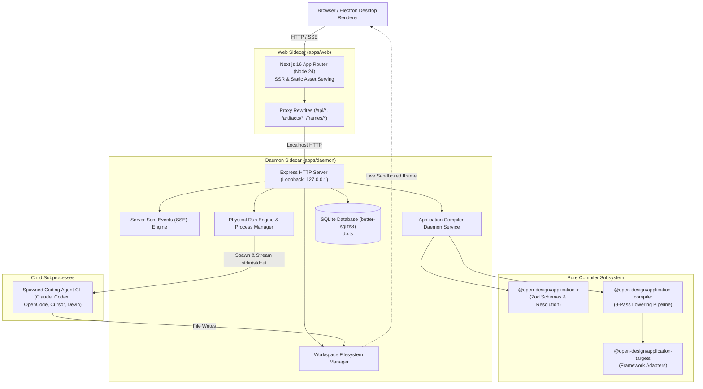
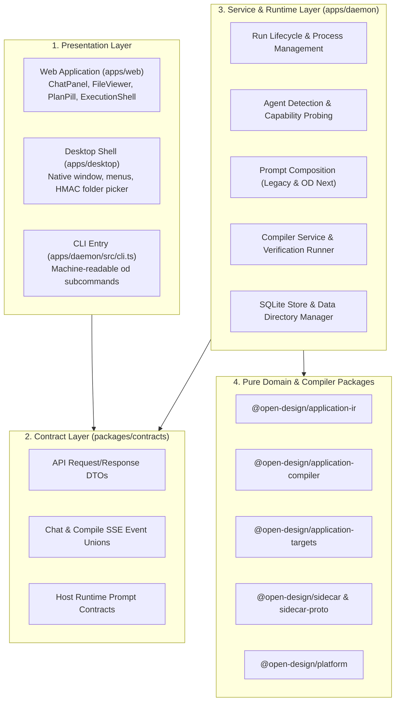
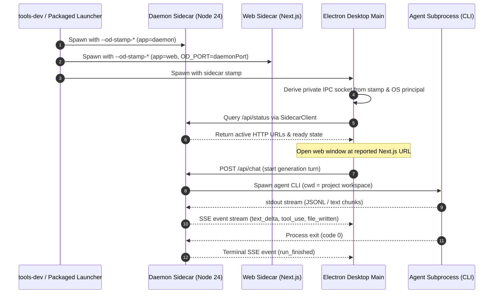
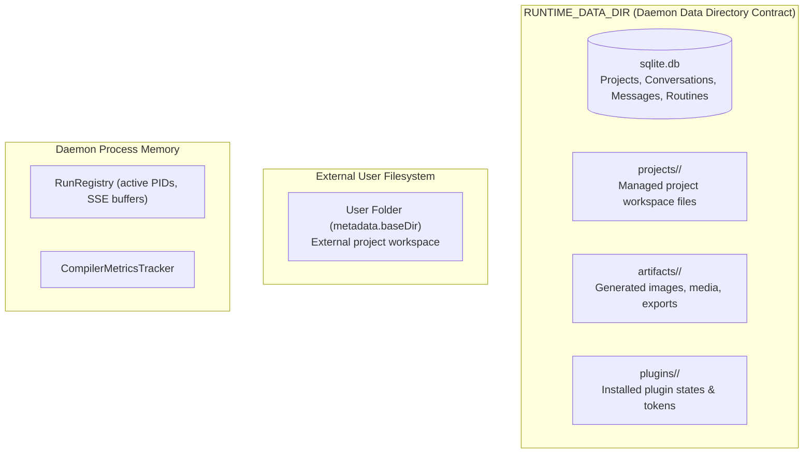

# Architecture

**Parent:** [`docs/orientation.md`](file:///home/sprime01/projects/open-design/docs/orientation.md) · **Mental Model:** [`docs/mental-model.md`](file:///home/sprime01/projects/open-design/docs/mental-model.md) · **Navigation:** [`docs/documentation-map.md`](file:///home/sprime01/projects/open-design/docs/documentation-map.md)

This document provides the canonical technical architecture specification for Open Design. It describes the system from multiple complementary perspectives: logical architecture, runtime/process topology, dependency rules, data ownership, control flow, and security boundaries.

---

## 1. System Topology Overview

Open Design is structured as a local-first system composed of a local capability daemon, a Next.js web application, an Electron desktop shell, external AI coding agents, and a multi-pass application compiler.



### What the reader should notice:
- **Same-Origin Access**: The frontend communicates with Next.js, which transparently proxies `/api/*` requests to the Express daemon. This prevents cross-origin CORS complexity while preserving clean separation.
- **Direct Filesystem Mutation**: Tool-capable AI agents spawn as local child processes and write code directly into the active project workspace on disk; Open Design does not force agents through synthetic virtual filesystems.
- **Pure Compiler Separation**: The compiler packages (`application-ir` and `application-compiler`) are pure TypeScript libraries independent of Express, Next.js, or DOM APIs.

---

## 2. Five Architectural Views

### 2.1 Logical Architecture
The logical components are structured into four major layers:



### 2.2 Runtime & Process Architecture
During execution, Open Design coordinates multiple operating system processes managed via sidecar stamps:



**Key Invariants of the Runtime Architecture:**
1. **The 5-Field Stamp**: Process identity is governed strictly by five argv fields: `channel`, `namespace`, `source`, `mode`, and `app`. IPC endpoints are derived dynamically from these five fields and the OS principal.
2. **Port Independence**: Runtime data paths, logs, caches, and IPC sockets never incorporate port numbers. Ports are transient transport details.
3. **No Cross-App Private Imports**: `apps/web` never imports from `apps/daemon/src/**`. Communication must strictly traverse loopback HTTP/SSE using contracts in `packages/contracts`.

### 2.3 Dependency Architecture
Package dependencies strictly flow downward from product carriers to pure contract and utility libraries:

```text
apps/web, apps/desktop, apps/packaged, apps/daemon
      │
      ▼
packages/contracts, packages/components, packages/host
      │
      ▼
packages/application-compiler
      │
      ▼
packages/application-ir
      │
      ▼
packages/sidecar ──► packages/sidecar-proto ──► packages/platform
```

- `packages/contracts` is pure TypeScript and must never depend on Node.js filesystem, child_process, SQLite, Next.js, or Express APIs.
- `packages/application-ir` and `packages/application-compiler` are pure TypeScript and must remain runnable in both browser and Node.js runtimes.

### 2.4 Data Architecture
Data ownership is strictly partitioned across persistent storage and ephemeral memory:



- **Single Truth Source**: `apps/daemon/src/daemon-paths.ts` resolves `OD_DATA_DIR` into `RUNTIME_DATA_DIR` once on startup. All internal paths flow from it.
- **External Folder Jailing**: Imported projects reside in `metadata.baseDir`. The daemon strictly asserts that file operations stay within that folder and never escapes to arbitrary parent directories.

### 2.5 Control Flow & Orchestration
The control plane operates on the principle of **UI/CLI dual-track parity**:
1. Every capability exposed in the Web UI is reachable through the `od` CLI (`apps/daemon/src/cli.ts`).
2. Both surfaces invoke identical daemon HTTP endpoints (`apps/daemon/src/routes/`).
3. External tools and automation agents (e.g. Claude Code, Codex, Slack bots) drive Open Design through the `od` CLI subcommands or the stdio MCP server (`apps/daemon/src/mcp-live-artifacts-server.ts`).

---

## 3. Trust & Security Boundaries

Open Design operates as a local-first development system with powerful local execution capabilities. It enforces strict security boundaries:

1. **Loopback Binding**: The daemon binds to `127.0.0.1` by default. Public or network-accessible deployments require explicit authentication and CORS configuration.
2. **Desktop Folder Import Auth Gate**: External folder imports via `POST /api/import/folder` require a short-lived HMAC token minted by the trusted Electron desktop process after native OS file picker verification ([`apps/daemon/src/desktop-auth.ts`](file:///home/sprime01/projects/open-design/apps/daemon/src/desktop-auth.ts)).
3. **Sandboxed Previews**: Generated deliverables render inside sandboxed `<iframe>` elements without `allow-same-origin` permissions, preventing generated code from stealing local cookies or tokens.
4. **Path Jailing**: All file manipulation endpoints validate paths against the resolved workspace root using `assertPathInsideProject()`.
5. **No Secret Leaks**: Telemetry and error logs redact API keys, access tokens, and environment credentials before dispatching events.

---

## 4. Subsystem Catalog & Deeper Reading

For complete implementation specifications of each subsystem, consult the dedicated guides:

- [Subsystem: Daemon Local Backend](file:///home/sprime01/projects/open-design/docs/subsystems/daemon.md) — Express, SQLite, SSE, data directory contract.
- [Subsystem: Web Frontend](file:///home/sprime01/projects/open-design/docs/subsystems/web.md) — Next.js 16, ChatPanel, ExecutionShell, PlanPill, iframe render modes.
- [Subsystem: Application Compiler](file:///home/sprime01/projects/open-design/docs/subsystems/compiler.md) — 9-pass pipeline, schemas, planners, manifests, conflict detection.
- [Subsystem: Agent Runtime Engine](file:///home/sprime01/projects/open-design/docs/subsystems/agent-runtimes.md) — 27 agent CLI adapters, detection, stream parsing.
- [Subsystem: Sidecar & Process Management](file:///home/sprime01/projects/open-design/docs/subsystems/sidecar.md) — Sidecar stamps, private IPC derivation, launcher runtime.
- [Subsystem: Content Registries](file:///home/sprime01/projects/open-design/docs/subsystems/content-registries.md) — Design systems, skills, templates, craft rules.
- [Subsystem: Development & Packaging Tools](file:///home/sprime01/projects/open-design/docs/subsystems/tools-dev-pack.md) — `tools-dev`, `tools-pack`, `tools-serve`.

---

## 5. Source Trail

- [`apps/daemon/src/server.ts`](file:///home/sprime01/projects/open-design/apps/daemon/src/server.ts) — Daemon composition root and route registration.
- [`apps/daemon/src/daemon-paths.ts`](file:///home/sprime01/projects/open-design/apps/daemon/src/daemon-paths.ts) — `RUNTIME_DATA_DIR` resolution.
- [`apps/daemon/src/runtimes/runs.ts`](file:///home/sprime01/projects/open-design/apps/daemon/src/runtimes/runs.ts) — Physical Run engine and process tree termination.
- [`packages/contracts/src/index.ts`](file:///home/sprime01/projects/open-design/packages/contracts/src/index.ts) — Pure TypeScript DTOs and event schemas.
- [`packages/application-compiler/src/compile.ts`](file:///home/sprime01/projects/open-design/packages/application-compiler/src/compile.ts) — 9-pass application compiler pipeline.
- [`packages/sidecar/src/index.ts`](file:///home/sprime01/projects/open-design/packages/sidecar/src/index.ts) — Sidecar client, stamps, and IPC transport.
- [`scripts/guard.ts`](file:///home/sprime01/projects/open-design/scripts/guard.ts) — Repository architectural boundary verification.
