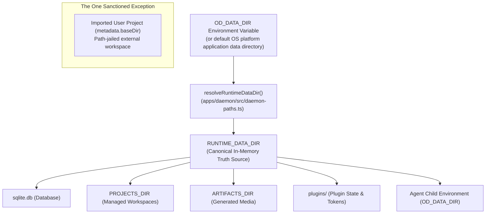

# Explanation: Why the Daemon Data Directory Contract?

**Parent:** [`docs/architecture.md`](file:///home/sprime01/projects/open-design/docs/architecture.md) · **Subsystem Guide:** [`docs/subsystems/daemon.md`](file:///home/sprime01/projects/open-design/docs/subsystems/daemon.md) · **Source Map:** [`docs/source-map.md`](file:///home/sprime01/projects/open-design/docs/source-map.md)

This document explains the single source of truth, security boundaries, and strict invariants governing daemon-managed storage in Open Design.

---

## 1. The Contract

> **Architectural Boundary (AGENTS.md line 68):**
> The daemon has exactly one active data-root truth source: on startup, `apps/daemon/src/server.ts` resolves `OD_DATA_DIR` into `RUNTIME_DATA_DIR`. All daemon-owned persistent paths must derive strictly from `RUNTIME_DATA_DIR` or from a constant derived from it (`PROJECTS_DIR`, `ARTIFACTS_DIR`).

This boundary is absolute. Hardcoded filesystem path examples, cwd-relative fallbacks, and improvised paths are strictly prohibited across all code, tests, and documentation.

---

## 2. Why a Strict Data Contract is Necessary

In local-first development applications that manage SQLite databases, local git repositories, and external AI agents, loose path handling causes severe issues:

1. **State Leaks**: If helper functions guess paths from `process.cwd()`, launching Open Design from different directories (e.g. repo root vs. `apps/daemon/` vs. home directory) creates fragmented, split-brain SQLite databases.
2. **Permission Disasters**: Hardcoded paths like `~/.open-design` fail under containerized deployments, restricted multi-user corporate environments, or portable installations on external drives.
3. **Subprocess Drift**: If a spawned AI agent subprocess does not inherit the exact data root resolved by the parent daemon, the agent might write artifacts or read memory from an entirely different location.
4. **Security Breaches**: Without explicit path jailing, malicious or hallucinatory agent file writes could escape into arbitrary system directories.

---

## 3. The Resolution Model

### Key Operational Rules:
- **One-Time Resolution**: `apps/daemon/src/daemon-paths.ts` resolves `RUNTIME_DATA_DIR` exactly once during process initialization. Downstream services must accept `RUNTIME_DATA_DIR` or pass it as an argument; they must never re-read `process.env.OD_DATA_DIR` with a cwd-fallback.
- **Subprocess Inheritance**: When the daemon spawns an agent CLI subprocess, it passes `OD_DATA_DIR: RUNTIME_DATA_DIR` in the child environment. The child inherits the daemon's resolved truth source without ambiguity.
- **The Imported Workspace Exception**: Imported-folder projects use `metadata.baseDir` for the user's external workspace. The daemon bounds file operations to that external workspace using `assertPathInsideProject()` and never copies the external repository into `PROJECTS_DIR`.

---

## 4. Forbidden Escape Candidates

Repository maintainers and guard scripts actively reject these recurring anti-patterns:
- ❌ Module-level defaults pointing at cwd-relative directories (e.g. `path.resolve(process.cwd(), '.data')`).
- ❌ Helper defaults such as `defaultRegistryRoots()` that recompute a data root from environment variables rather than receiving `RUNTIME_DATA_DIR`.
- ❌ `openDatabase(projectRoot)` calls that rely on fallback defaults instead of passing the explicit resolved data root.
- ❌ Documentation, script help text, or examples suggesting concrete legacy paths.

---

## 5. Source Trail

- [`AGENTS.md`](file:///home/sprime01/projects/open-design/AGENTS.md) — Section: Daemon data directory contract.
- [`apps/daemon/src/daemon-paths.ts`](file:///home/sprime01/projects/open-design/apps/daemon/src/daemon-paths.ts) — Canonical path resolution logic.
- [`apps/daemon/src/server.ts`](file:///home/sprime01/projects/open-design/apps/daemon/src/server.ts) — Server initialization and `RUNTIME_DATA_DIR` export.
- [`apps/daemon/src/project-locations.ts`](file:///home/sprime01/projects/open-design/apps/daemon/src/project-locations.ts) — Path jailing assertions (`assertPathInsideProject`).
