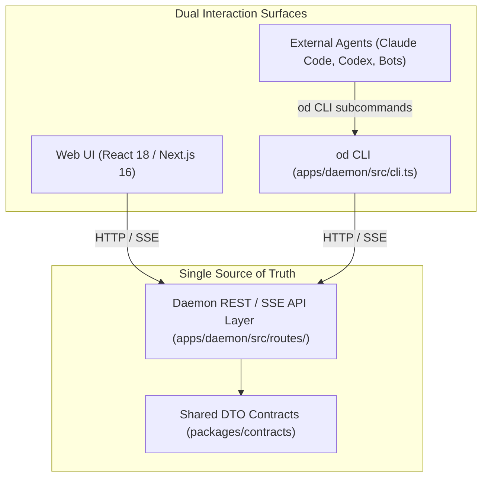

# Explanation: Why UI and CLI Dual-Track Interface?

**Parent:** [`docs/architecture.md`](file:///home/sprime01/projects/open-design/docs/architecture.md) · **Source Map:** [`docs/source-map.md`](file:///home/sprime01/projects/open-design/docs/source-map.md) · **CLI Reference:** [`docs/reference/cli.md`](file:///home/sprime01/projects/open-design/docs/reference/cli.md)

This document explains the architectural rationale, constraints, and consequences behind Open Design's mandatory **UI/CLI dual-track** interface rule.

---

## 1. The Rule

> **Architectural Invariant (AGENTS.md line 265):**
> Every user-facing capability in Open Design must be reachable through both the Web UI and the `od` CLI (`apps/daemon/src/cli.ts`). Shipping a feature on only one surface is considered a defect and is rejected in code review.

---

## 2. Context & Problem Statement

Modern developer platforms often suffer from an interface imbalance:
- If built primarily as a GUI, they become impossible to automate, script in CI/CD, or drive via autonomous coding agents.
- If built purely as a CLI, they lack the rich, visual, exploratory feedback loop (live sandboxed previews, interactive tweak sliders, visual element inspection) essential for design engineering.

Furthermore, many products attempt to solve this by creating disparate backends: a GUI talking to internal RPCs or GraphQL, and a CLI talking to a separate set of REST APIs or executing local scripts directly. This invariably causes feature drift, divergent authorization rules, and broken client behaviors.

---

## 3. Design Rationale (Verified)

Open Design resolves this tension through three architectural design choices:

### 1. The Embeddability Contract for External Agents
External AI agents (Claude Code, Hermes Agent, Cursor, CI scripts, headless runners) do not render DOM elements or click React buttons. They interact with their host operating system via shell commands. If a capability (e.g. creating a project, running a compile, inspecting conflicts, triggering routines) were UI-only, external agents would be locked out. By providing `od <subcommand> --json`, Open Design becomes fully programmable and composable into higher-order agent workflows.

### 2. Single Source of Truth
Neither the Web UI nor the CLI contains independent business logic. Both are thin clients communicating with the exact same daemon HTTP endpoints (`/api/*`). The shared request and response payloads are defined strictly in `packages/contracts`. 

### 3. Machine-Readable Automation
Every CLI subcommand supports `--json` for clean piping into `jq`, `xargs`, or scripts, and supports `--prompt-file <path|->` for passing complex multi-line prompts via stdin or heredocs without hitting OS shell argument length limits.

---

## 4. Consequences & Trade-Offs

### Advantages:
- **Zero API Drift**: When an endpoint changes, both the web UI and CLI update together in the same pull request.
- **Headless & CI Readiness**: Any workflow demonstrated in the browser can be replicated identically in a headless CI runner via `od`.
- **First-Class MCP Integration**: The stdio MCP server directly maps to the same capabilities exposed by the CLI.

### Costs & Constraints:
- **Higher Authoring Overhead**: Contributing a new feature requires landing three surfaces simultaneously in the same pull request: the daemon route, the Web UI component, and the `od` CLI subcommand in `SUBCOMMAND_MAP`. Pull requests that implement only one surface are blocked.

---

## 5. Source Trail

- [`AGENTS.md`](file:///home/sprime01/projects/open-design/AGENTS.md) — Dual-track policy definition.
- [`apps/daemon/src/cli.ts`](file:///home/sprime01/projects/open-design/apps/daemon/src/cli.ts) — `SUBCOMMAND_MAP` and CLI command handlers.
- [`packages/contracts/src/api/`](file:///home/sprime01/projects/open-design/packages/contracts/src/api/) — Shared DTO contracts.
- [`apps/daemon/src/routes/`](file:///home/sprime01/projects/open-design/apps/daemon/src/routes/) — Shared HTTP endpoints.
