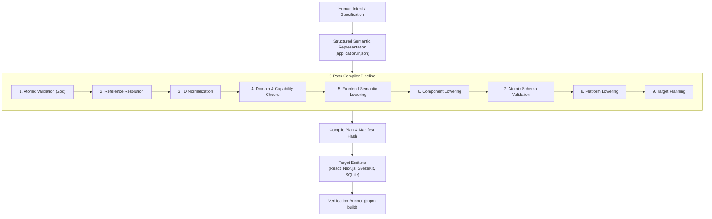

# Explanation: Why a 9-Pass Application Compiler?

**Parent:** [`docs/architecture.md`](file:///home/sprime01/projects/open-design/docs/architecture.md) · **Subsystem Guide:** [`docs/subsystems/compiler.md`](file:///home/sprime01/projects/open-design/docs/subsystems/compiler.md) · **Source Map:** [`docs/source-map.md`](file:///home/sprime01/projects/open-design/docs/source-map.md)

This document explains the architectural rationale for building a multi-pass semantic lowering compiler rather than relying on direct LLM code generation or simple file templating.

---

## 1. The Context: The Limits of Raw LLM Code Generation

Most AI code generators take a natural-language prompt and immediately prompt a model to emit entire files (`App.tsx`, `package.json`, etc.). While impressive in initial demos, this approach creates fundamental maintenance and reliability problems:

1. **Non-Determinism**: Asking for the same application twice generates completely different file structures, naming conventions, and dependency versions.
2. **The "Silent Overwrite" Problem**: Every subsequent regeneration wipes out manual edits or fixes the developer made to the code.
3. **Framework Lock-In**: A prompt written for Next.js cannot easily emit React/Vite or SvelteKit without rewriting the entire prompt and risking regressions.
4. **Hallucinated Sensitive Logic**: When auth rules, pricing calculations, or data retention policies are ambiguous, LLMs invent assumptions silently rather than halting for human review.
5. **Lack of Verifiability**: LLMs often generate syntax errors, broken imports, or missing dependencies that fail during `npm run build`.

---

## 2. The Solution: Compiler-Grade Semantic Lowering

Open Design treats application generation as a **compilation problem**:

### Key Design Rationales:

### 1. Semantic Decoupling (Intent vs. Implementation)
The Application IR captures what an application *is* (its entities, commands, queries, auth requirements, and screen layouts) without knowing how React hooks, Svelte stores, or Next.js Server Actions work. The exact same IR compiles into:
- A client-side `react-vite` SPA.
- A server-side `nextjs-app` with React Server Components.
- A lightweight `sveltekit` app.
- A typed `sqlite-better-sqlite3` database schema with migration runners.

### 2. Intermediate Representation Normalization
Passes 2 and 3 resolve cross-references and sort identifiers deterministically. Re-compiling the exact same IR bundle with the same target adapter produces byte-identical files, making builds cache-friendly and CI-safe.

### 3. Cryptographic Manifests & Conflict Preservation
Instead of blindly overwriting disk files, the compiler maintains a `GeneratedFileManifest` containing cryptographic content hashes of everything it previously emitted. If a developer hand-edits `src/App.tsx`, the compiler detects that the on-disk hash differs from the manifest hash, flags a `conflict`, and halts compilation under the default `block` policy.

### 4. Verification as a Compiler Phase
A compile is never marked as `succeeded` merely because files were written to disk. Pass 9 runs automated verification (running `vite build`, `next build`, or `tsc --noEmit`). Success is reported only when the emitted code is proven to compile cleanly.

---

## 3. Trade-Offs & Constraints

- **Upfront Rigor**: Developers or agents must define applications using valid IR schemas rather than a one-line vague prompt.
- **Lowering Overhead**: Running a 9-pass compiler takes ~50–150ms of CPU time before projection begins. This overhead is negligible compared to network model calls, but requires disciplined pure-TypeScript pass implementations.

---

## 4. Source Trail

- [`packages/application-ir/src/schemas/`](file:///home/sprime01/projects/open-design/packages/application-ir/src/schemas/) — Zod IR schemas.
- [`packages/application-compiler/src/pipeline.ts`](file:///home/sprime01/projects/open-design/packages/application-compiler/src/pipeline.ts) — 9-pass lowering pipeline.
- [`packages/application-compiler/src/compile.ts`](file:///home/sprime01/projects/open-design/packages/application-compiler/src/compile.ts) — Compile orchestrator.
- [`packages/application-compiler/src/conflict.ts`](file:///home/sprime01/projects/open-design/packages/application-compiler/src/conflict.ts) — Manifest hashing and conflict classification.
