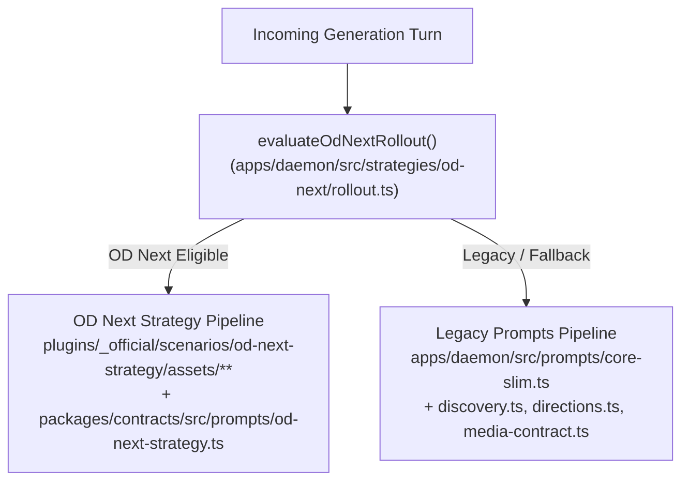

# Explanation: Why Two Prompt Implementations?

**Parent:** [`docs/architecture.md`](file:///home/sprime01/projects/open-design/docs/architecture.md) · **Prompt Composition Spec:** [`docs/prompt-composition.md`](file:///home/sprime01/projects/open-design/docs/prompt-composition.md) · **Source Map:** [`docs/source-map.md`](file:///home/sprime01/projects/open-design/docs/source-map.md)

This document explains the architecture, rollout switch mechanics, and maintenance rules governing Open Design's two independent prompt composition pipelines.

---

## 1. The Architectural Fork

In Open Design, a generation run is composed by **ONE of two completely independent prompt implementations**. The fork occurs as an early return at the top of `composeSystemPrompt`:

```ts
// apps/daemon/src/prompts/system.ts:905
export function composeSystemPrompt({ ... }: ComposeInput): string {
  if (odNextStrategyRecipe) {
    return composeOdNextStrategyRequestPromptV2(odNextStrategyRecipe, { ... });
  }
  // ↓ EVERYTHING BELOW — the entire legacy stack — is skipped on the OD Next path
  ...
}
```

The API / BYOK mirror at [`packages/contracts/src/prompts/system.ts:318`](file:///home/sprime01/projects/open-design/packages/contracts/src/prompts/system.ts) forks in exactly the same way. The two implementations share **no composition floor**: a prompt rule or constraint added to one implementation does not apply to runs that take the other.

---

## 2. The Two Implementations



1. **Legacy Pipeline (`apps/daemon/src/prompts/`)**:
   - Programmatic TypeScript composition assembling `core-slim.ts` (default) or `official-system.ts`, `discovery.ts`, and `media-contract.ts`.
   - Mirrored for API/BYOK in `packages/contracts/src/prompts/`.
2. **OD Next Pipeline (`plugins/_official/scenarios/od-next-strategy/`)**:
   - Scenario-driven modular architecture. The model receives raw markdown assets sent verbatim from the plugin bundle, combined with host runtime contracts defined in `packages/contracts/src/prompts/od-next-strategy.ts`.

---

## 3. Rollout Switch & Evaluation Mechanics

OD Next is enabled by default, but evaluated per run by `evaluateOdNextRollout` ([`apps/daemon/src/strategies/od-next/rollout.ts:138`](file:///home/sprime01/projects/open-design/apps/daemon/src/strategies/od-next/rollout.ts)). A run takes OD Next only if all criteria are met:
- **Scenario Provenance**: `provenance === 'automatic_default'`. If a user manually selected an explicit scenario, it resolves to `null` and takes the legacy path.
- **Agent Allowlist**: `agentId` must be one of `codex`, `claude`, `opencode`, or `amr`.
- **Source Kind**: Must be `bundled`.
- **Preflight Gate**: The runtime capability preflight must have passed.

### User-Facing Controls:
- **Settings UI**: Settings -> Labs -> Design Harness (`apps/web/src/components/LabsSection.tsx`).
- **Configuration Key**: App config `odNextStrategyMode` (`active` vs. `off`).
- **Environment Override**: `OD_NEXT_STRATEGY_ROLLOUT=0` or `1`.

Because eligibility depends on run-specific facts (e.g. which agent is active, whether a scenario was explicitly chosen), **two runs on the same machine may take different paths**. This is why divergence between the two implementations often manifests as an intermittent bug.

---

## 4. Host Runtime Contracts

Host runtime contracts belong to the **host platform**, not to either prompt strategy. They ensure that generated artifacts remain controllable by the Open Design UI:

| Contract Marker | Host Consumer | Behavior if Omitted |
|---|---|---|
| `data-od-deck-protocol="1"` | `apps/web/src/runtime/srcdoc.ts` | Host fails to recognize an HTML deck; slide toolbar disappears. |
| `od:deck-ready` | `srcdoc.ts` ready listener | Paging controls stay disabled because ready handshake never fired. |
| `od:slide-state` | Web slide counter | Slide numbers and progress indicators do not update. |
| `id="deck-stage"` | `srcdoc.ts` layout fix | Full-screen presentation mode breaks. |
| `<question-form>` | `AssistantMessage.tsx` | Clarification questions fail to render as interactive forms. |

Whenever prompt text is modified, both the Legacy and OD Next implementations must continue to honor these host runtime contracts.

---

## 5. Source Trail

- [`docs/prompt-composition.md`](file:///home/sprime01/projects/open-design/docs/prompt-composition.md) — Comprehensive variant axes and worked examples.
- [`apps/daemon/src/prompts/system.ts`](file:///home/sprime01/projects/open-design/apps/daemon/src/prompts/system.ts) — Main fork point at line 905.
- [`apps/daemon/src/strategies/od-next/rollout.ts`](file:///home/sprime01/projects/open-design/apps/daemon/src/strategies/od-next/rollout.ts) — Rollout policy evaluator.
- [`packages/contracts/src/prompts/od-next-strategy.ts`](file:///home/sprime01/projects/open-design/packages/contracts/src/prompts/od-next-strategy.ts) — Host contracts for OD Next.
