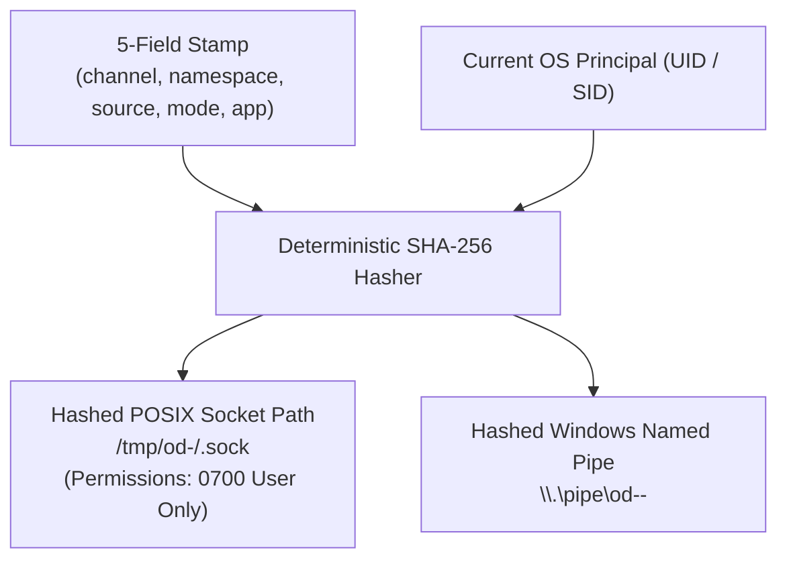

# Explanation: Why 5-Field Sidecar Process Stamps?

**Parent:** [`docs/architecture.md`](file:///home/sprime01/projects/open-design/docs/architecture.md) · **Subsystem Guide:** [`docs/subsystems/sidecar.md`](file:///home/sprime01/projects/open-design/docs/subsystems/sidecar.md) · **Source Map:** [`docs/source-map.md`](file:///home/sprime01/projects/open-design/docs/source-map.md)

This document explains the architectural principles, failure modes avoided, and security guarantees behind Open Design's **5-field sidecar process stamp** model.

---

## 1. The 5-Field Stamp Invariant

In Open Design, sidecar processes (the Express daemon, the Next.js web server, the Electron desktop host) are identified strictly by five command-line arguments:

```bash
--od-stamp-channel <channel>     # Release channel (stable, beta, prerelease, preview, dev)
--od-stamp-namespace <namespace> # Isolation namespace (default, or test worker ID)
--od-stamp-source <source>       # Carrier identity (tools-dev, packaged)
--od-stamp-mode <mode>           # Runtime mode (development, production)
--od-stamp-app <app>             # Subsystem role (daemon, web, desktop)
```

### Absolute Invariants:
1. **The stamp has exactly five fields**. IPC paths, PIDs, and network ports are never stamp fields.
2. **Identity is argv-only**. Open Design never creates stamp-derived `.pid` files or state manifests on disk to establish identity.
3. **Ports do not participate in paths**. Runtime logs, caches, SQLite databases, and IPC endpoints never incorporate port numbers.

---

## 2. Why Argv-Only Identity Over State Files?

Traditional process managers frequently write PID files (e.g. `/var/run/daemon.pid`) or status JSON manifests. In developer tools and multi-process desktop apps, state files create recurring failure modes:

- **Stale State on Crash**: If a process crashes violently (`SIGKILL` or power loss), the PID file remains on disk. On the next launch, the system either mistakenly believes the process is still running, or worse, targets an unrelated process that recycled that PID.
- **Race Conditions**: Two instances launching simultaneously can race on writing and checking state files.
- **Permission Clashes**: Leftover state files with root or restrictive permissions block subsequent developer runs.

**The Argv-Only Solution**:
By encoding identity directly into argv flags, the operating system's native process table becomes the **single source of truth**. When `@open-design/sidecar` queries process status, it inspects running processes owned by the current OS principal. A process exists if and only if the OS confirms it is currently executing. Dead processes leave zero residual identity state.

---

## 3. Why Ports Must Not Dictate Paths

Many multi-service setups derive directories from allocated ports (e.g. `.tmp/server-7456/`). This is an anti-pattern:
- **Port Collisions**: If port `7456` is in use and the tool dynamically picks `7457`, persistent data or logs become fragmented across multiple directories.
- **Replay & Test Fragility**: Parallel CI workers running on ephemeral ports cannot maintain predictable paths for artifacts and reports.
- **Cache Invalidation**: Build caches tied to ports cannot be reused across consecutive runs.

In Open Design, **namespaces control paths; ports are transient transport details**. Passing `--namespace test-1` guarantees that logs live at `.tmp/tools-dev/test-1/` regardless of which network ports are assigned.

---

## 4. Opaque, Principal-Scoped Private IPC

Sidecars communicate control-plane status over local IPC sockets rather than open network ports. To prevent local privilege escalation or multi-user cross-talk on shared Linux/macOS machines:



1. The IPC endpoint is computed from the SHA-256 hash of the 5-field stamp concatenated with the current user's OS identifier.
2. POSIX socket directories are created with `0700` permissions (read/write/execute by the current user only).
3. Callers treat the concrete path as completely opaque; orchestration layers connect solely through the `SidecarClient` boundary.

---

## 5. Source Trail

- [`packages/sidecar/src/stamp.ts`](file:///home/sprime01/projects/open-design/packages/sidecar/src/) — 5-field stamp parser and validator.
- [`packages/sidecar/src/transport/`](file:///home/sprime01/projects/open-design/packages/sidecar/src/) — Private IPC derivation.
- [`packages/platform/src/process.ts`](file:///home/sprime01/projects/open-design/packages/platform/src/) — Argv process matching.
