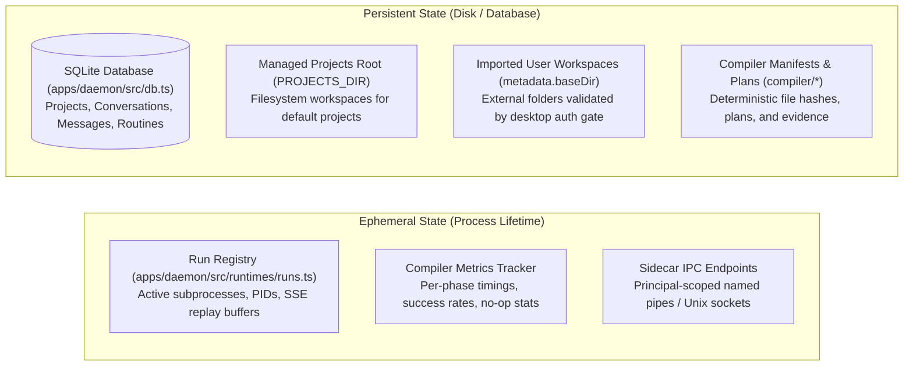

# Layer 1: System Mental Model

This document explains the conceptual structure of Open Design. It abstracts away low-level mechanics to focus on responsibilities, boundaries, major abstractions, and state lifecycles.

---

## 1. The Dual-Engine Architecture

Open Design is not a monolithic application generator. It is an AI design engineering platform organized around **two distinct but complementary execution engines**:

```mermaid
graph TD
    subgraph Engine1["Engine 1: Creative Agent Studio"]
        StudioPrompt["Conversational Prompt / Brief"] --> Composer["Prompt Composer<br/>(Design Systems + Skills + Craft)"]
        Composer --> ChildProcess["Spawned Agent Process<br/>(Claude, Codex, OpenCode, etc.)"]
        ChildProcess --> LiveEvents["SSE Event Stream"]
        LiveEvents --> LivePreview["Sandboxed Live Preview<br/>(Interactive HTML / CSS / Decks)"]
    end

    subgraph Engine2["Engine 2: Application Compiler"]
        IRSpec["application.ir.json<br/>(Domain, Capabilities, Boundaries, UI)"] --> Lowering["9-Pass Lowering Pipeline<br/>(Validation, Normalization, AST)"]
        Lowering --> Planner["Compile Planner<br/>(Manifest Diff & Conflict Check)"]
        Planner --> Emitters["Target Framework Adapters<br/>(React/Vite, Next.js, SvelteKit, SQLite)"]
        Emitters --> VerifiedBuild["Verified Output Code<br/>(Typecheck & Production Build Clean)"]
    end
```

### Engine 1: The Creative Agent Studio Loop
- **Primary Goal**: Rapid, exploratory, high-taste visual prototyping and collaborative design engineering.
- **How It Operates**: The user prompts in natural language. Open Design detects which coding agent CLI is installed locally (e.g. Claude Code, Codex, OpenCode, Cursor, Devin), injects curated design intelligence (tokens, typography, component fixtures, and craft rules), and spawns the agent in a local workspace.
- **Output**: Interactive HTML, CSS, JavaScript, interactive slide decks, or prototypes rendered in a sandboxed iframe. The user can inspect elements, leave visual comments, adjust palettes, and steer the turn in real time.

### Engine 2: The Application Compiler Pipeline
- **Primary Goal**: Deterministic, verifiable, framework-native software generation from structured intent.
- **How It Operates**: The user defines an application using a versioned semantic model (`application.ir.json`). The compiler executes a 9-pass lowering pipeline, builds a file-by-file compile plan, preserves existing manual edits using manifest hashing, invokes target adapters, and runs automated build/typecheck verification.
- **Output**: Full-stack, build-clean, installable codebases in React + Vite, Next.js App Router, SvelteKit, or standalone SQLite databases with typed migrations.

---

## 2. Core Abstractions & Their Roles

| Abstraction | Domain | Role in System | Key Invariant |
|---|---|---|---|
| **Application IR** | Compiler | Framework-neutral semantic representation of an entire app. | Must be strictly serializable to JSON; validated via Zod schemas. No framework-specific syntax. |
| **Target Adapter** | Compiler | Translator from lowered IR AST nodes to framework files. | Adapters must declare output paths, support planning passes without writing disk files, and be deterministic. |
| **Generated Manifest** | Compiler | Cryptographic ledger of compiler-owned files and hashes. | A file whose disk hash differs from the manifest is classified as a conflict and is never silently overwritten. |
| **RuntimeAgentDef** | Studio / Daemon | Specification of an AI CLI harness. | Must declare launch arguments, auth probing, stream parsing, and prompt delivery formats (`text` vs `stream-json`). |
| **Physical Run** | Studio / Daemon | In-memory lifecycle tracking one active model turn. | Every run must be started through `internalRunCreation.start()` to preserve analytics and process teardown lineage. |
| **Sidecar Stamp** | System / Platform | 5-tuple identifying a process role. | Must have exactly five fields: `channel`, `namespace`, `source`, `mode`, `app`. Ports are never stamp fields. |
| **Design System** | Content Knowledge | Brand aesthetics specification (`DESIGN.md`). | Must declare required color and typography tokens; fixtures in `components.html` must synchronize with `tokens.css`. |
| **Craft Rules** | Content Knowledge | Universal brand-agnostic heuristics. | Opted into via `od.craft.requires`. Covers accessibility, animation discipline, anti-ai-slop, and state coverage. |

---

## 3. State Ownership & Boundaries

Open Design enforces strict boundaries regarding where state lives, who mutates it, and how it survives restarts:

### 1. SQLite Database (`apps/daemon/src/db.ts`)
- **Owner**: Daemon process exclusively.
- **Contents**: Project metadata, conversation logs, message event batches, preview comments, tabs, deployments, and scheduled automation routines.
- **Location**: Strictly derived from `RUNTIME_DATA_DIR` on daemon startup.

### 2. Project Workspaces (Filesystem)
- **Managed Projects**: Reside within `PROJECTS_DIR` (under `RUNTIME_DATA_DIR`). The daemon creates and garbage-collects these workspaces.
- **Imported Projects**: Reside in user-selected external directories (stored in `metadata.baseDir`). The daemon never moves or copies them into managed storage; all operations are strictly bounded and path-jailed.

### 3. In-Memory Run Service (`apps/daemon/src/runtimes/runs.ts`)
- **Owner**: Daemon run engine.
- **Contents**: Child process handles, process tree PIDs, active SSE listener connections, and buffered stdout chunks for replay.
- **Lifecycle**: Cleared on daemon restart. Any runs interrupted by a daemon restart transition to `failed` with code `DAEMON_RESTARTED`.

---

## 4. Communication & Runtime Mechanics

Open Design deliberately eschews complex distributed service meshes or WebSocket buses in favor of three simple, resilient communication mechanisms:

1. **Loopback HTTP + Server-Sent Events (SSE)**:
   - The web frontend (`apps/web`) communicates with the daemon (`apps/daemon`) over same-origin loopback HTTP.
   - Streaming model output, tool executions, and compilation progress are dispatched as SSE text streams (`POST /api/chat`, `GET /api/compiler/runs/:runId/events`).
   - Why SSE over WebSockets? SSE traverses HTTP/2 proxies cleanly, auto-reconnects natively, and provides straightforward uni-directional event logging.
2. **Private Sidecar IPC**:
   - The Electron desktop shell (`apps/desktop`) does not guess ports. It derives an opaque, private IPC endpoint based on the 5-field stamp and OS principal, queries sidecar status via `@open-design/sidecar`, and learns the active daemon/web URL.
3. **Sandboxed Iframe Bridges**:
   - Live previews in the browser run in sandboxed `<iframe>` elements.
   - For simple static pages, previews load over HTTP. When interactive inspection, comment anchoring, deck navigation, or tweak palettes are active, previews use `srcDoc` mode to inject secure `postMessage` bridges.

---

## 5. Next Steps

- To explore how these conceptual components map to concrete directories and processes, proceed to [Architecture Overview](file:///home/sprime01/projects/open-design/docs/architecture.md).
- To study domain-specific terms in greater depth, see [Domain Vocabulary & Concepts](file:///home/sprime01/projects/open-design/docs/concepts.md).
- To examine individual modules, explore the [Subsystems Directory](file:///home/sprime01/projects/open-design/docs/subsystems/).
