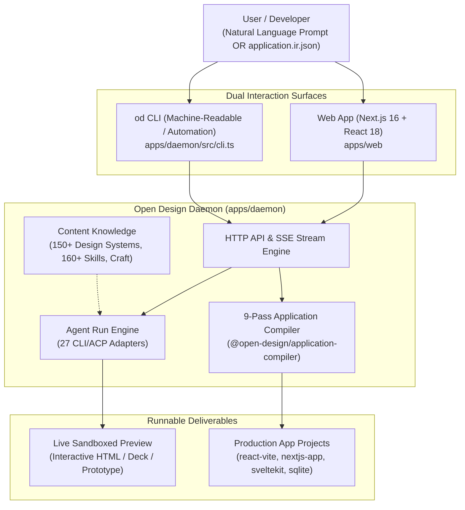

# Layer 0: Orientation & System Identity

Welcome to **Open Design**. This document provides an accessible orientation for engineers entering the codebase for the first time. It establishes what the software is, the problem it solves, how its major pieces interact, and where to go next.

---

## 1. What This Project Is

> **One-Sentence Definition:**
> Open Design is a local-first application generation and AI design engineering platform that turns natural-language briefs or formal semantic specifications into runnable, framework-native software with brand-grade aesthetics.

Open Design operates in two primary modes:
1. **The Creative Studio**: An interactive, local-first canvas where coding agents (Claude, Codex, OpenCode, Cursor, etc.) execute design skills infused with 150+ real brand design systems (Linear, Stripe, Apple, Airbnb), writing directly to a project workspace and rendering live in sandboxed preview iframes.
2. **The Application Compiler**: A deterministic, 9-pass compiler pipeline that takes an intermediate representation (`application.ir.json` defining domain entities, capabilities, API boundaries, persistence, and screens) and compiles it into clean, verified, production-ready code across multiple target frameworks (`react-vite`, `nextjs-app`, `sveltekit`, `html-static`, `sqlite-better-sqlite3`).

---

## 2. What Problem It Solves

Turning a product idea into real, production-ready software traditionally forces an unacceptable compromise:

- **Manual Engineering Handoff**: Designers draw mockups in Figma; developers rebuild them from scratch in code. This process is slow, expensive, and the visual fidelity rarely survives the handoff intact.
- **No-Code / Low-Code Builders**: Quick to start, but lock teams into proprietary hosted platforms that produce bloated code and look distinctly amateur.
- **Generic AI Code Generators**: Quickly generate code, but produce generic "AI defaults" (bland blue buttons, flat cards, no distinctive typography). Worse, re-prompting frequently overwrites manual customizations, and sensitive authorization or data deletion rules are fabricated out of thin air.
- **Static Prototypes**: Clickable prototypes look great, but have no real database, no working forms, and cannot be handed to actual users.

**Open Design eliminates these compromises.** It combines brand-grade design intelligence (`DESIGN.md` rules, design tokens, and craft guidelines) with deterministic compiler verification. When compiling, your application's semantic intent is preserved, hand-edited files are protected against overwrites, sensitive logic requires explicit human resolution, and generated code is guaranteed to pass typechecks and production builds.

---

## 3. The System in One Picture

Here is the high-level mental model showing how human intent flows through Open Design into running software:

---

## 4. The 8 Concepts You Need First

To navigate the codebase comfortably, you only need to understand these eight terms:

1. **Daemon (`apps/daemon`)**: The local Express backend that owns SQLite storage, file workspaces, agent process lifecycles, and SSE streaming. It binds to localhost and acts as the capability authority.
2. **Web App (`apps/web`)**: The Next.js 16 frontend providing the chat interface, execution tree, live iframe preview, and design settings.
3. **Application IR (`application.ir.json`)**: A versioned, structured semantic specification defining an application's domain models, capabilities, API boundaries, persistence, and frontend screens without binding to any specific UI framework.
4. **Target Adapter**: A compiler backend plugin (e.g. `react-vite`, `nextjs-app`, `sqlite-better-sqlite3`) that lowers abstract IR concepts into concrete framework files.
5. **Compile Plan & Manifest**: Before writing any file, the compiler builds a deterministic plan classifying changes as creates, modifies, reuses, or conflicts. The `manifest.json` tracks ownership and hashes so the compiler never blindly overwrites your hand-written code.
6. **Sidecar Stamp**: A strict 5-field tuple (`channel`, `namespace`, `source`, `mode`, `app`) that uniquely identifies daemon and web subprocesses and deterministically derives private IPC paths.
7. **`<question-form>`**: A markdown artifact emitted by AI agents when user intent is ambiguous. Rather than guessing sensitive details, the agent pauses and renders an interactive form directly in the chat.
8. **Design System (`DESIGN.md`)**: A structured directory containing typography rules, spacing tokens, color palettes, and component fixtures modeled after premier product studios.

---

## 5. A Representative Journey

Consider what happens when a developer compiles an application using the Open Design compiler:

1. **Scaffold**: The developer initializes a project using `od app init --project ./my-app`. This scaffolds `application.ir.json` describing domain models (e.g. `User`, `Post`), queries, and UI screens.
2. **Validation & Lowering**: The developer runs `od app compile --project ./my-app --target react-vite`. The daemon loads the IR and passes it through `@open-design/application-compiler`. The 9-pass pipeline validates the schemas, checks cross-references, and lowers domain models into framework-agnostic AST nodes.
3. **Conflict Detection**: The compiler inspects `./my-app/generated/react-vite`. If a developer previously modified a generated file by hand, the compiler detects the hash difference against the prior manifest and flags a conflict rather than overwriting the work.
4. **Code Projection**: The `react-vite` target adapter projects the lowered IR into concrete files (`src/App.tsx`, `src/components/`, `package.json`, `vite.config.ts`).
5. **Verification**: The daemon's `VerificationRunner` executes `pnpm install` and `vite build` within the output folder. If typecheck or build errors occur, the compile fails visibly with structured diagnostics.
6. **Result**: The developer receives a clean, buildable, typecheck-clean React application ready to be deployed.

---

## 6. Where to Go Next

Choose your destination based on your objective:

- **I want to run the project locally**: Read [Local Development Lifecycle](file:///home/sprime01/projects/open-design/docs/workflows/local-dev-lifecycle.md) and run `pnpm tools-dev`.
- **I want to understand the architecture**: Read [System Mental Model](file:///home/sprime01/projects/open-design/docs/mental-model.md) followed by [Canonical Architecture](file:///home/sprime01/projects/open-design/docs/architecture.md).
- **I want to compile my first app**: Follow the step-by-step tutorial [Building Your First App from IR](file:///home/sprime01/projects/open-design/docs/tutorials/build-first-app-from-ir.md).
- **I want to add a new AI agent CLI**: Read [Subsystem: Agent Runtimes](file:///home/sprime01/projects/open-design/docs/subsystems/agent-runtimes.md) and follow [How to Add an Agent Adapter](file:///home/sprime01/projects/open-design/docs/how-to/add-agent-adapter.md).
- **I want to look up CLI commands or API endpoints**: Consult the [CLI Reference](file:///home/sprime01/projects/open-design/docs/reference/cli.md) and [REST API Reference](file:///home/sprime01/projects/open-design/docs/reference/api-and-sse.md).
- **I am debugging an issue**: Check the diagnostic guide in [Troubleshooting](file:///home/sprime01/projects/open-design/docs/troubleshooting.md).
