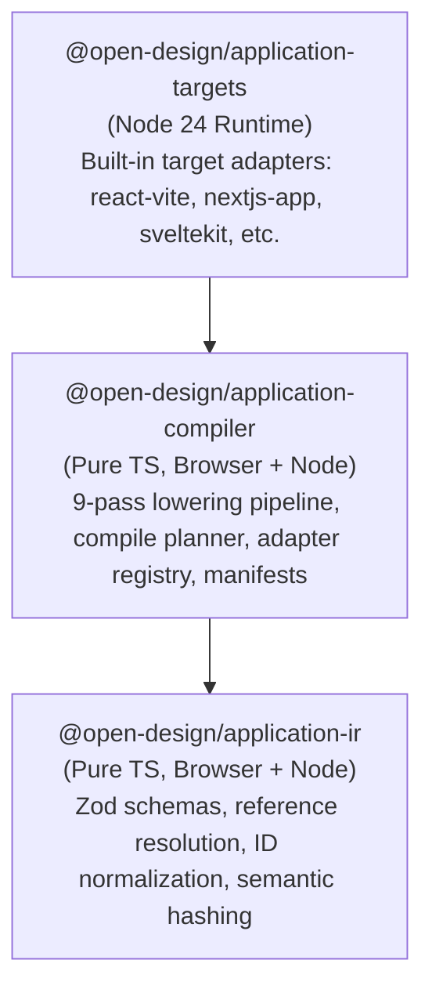
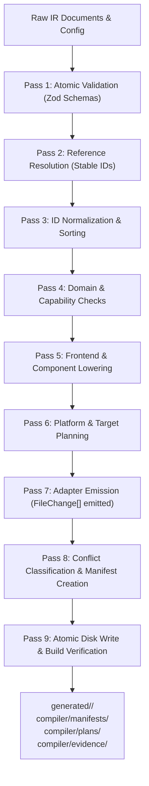

# Subsystem Guide: Application Compiler

**Parent:** [`docs/architecture.md`](file:///home/sprime01/projects/open-design/docs/architecture.md) · **Source Map:** [`docs/source-map.md`](file:///home/sprime01/projects/open-design/docs/source-map.md) · **Workflow Trace:** [`docs/workflows/application-compilation.md`](file:///home/sprime01/projects/open-design/docs/workflows/application-compilation.md)

This document specifies the architecture, pipeline stages, AST lowering passes, conflict policies, and extension points of the Application Compiler subsystem.

---

## 1. Purpose

The Application Compiler translates a formal, framework-agnostic semantic intermediate representation (`application.ir.json`) into production-ready, buildable software codebases across multiple target stacks (React/Vite, Next.js App Router, SvelteKit, SQLite).

Unlike conversational code generators that rewrite code unpredictably, the compiler is **deterministic, verifiable, and conflict-preserving**: identical inputs produce byte-identical output, manual code customizations are protected from overwrites, and generated projects are guaranteed to pass typecheck and production build gates.

---

## 2. Subsystem Packages

The compiler is organized into three strictly partitioned packages:



1. **`@open-design/application-ir`**: Defines the versioned schemas for domain models, capabilities, API boundaries, persistence, and frontend screens. Contains zero Node.js filesystem or network dependencies.
2. **`@open-design/application-compiler`**: Owns the 9-pass lowering pipeline, target planning, manifest generation, and conflict classification. Pure TypeScript, runnable in any JavaScript runtime.
3. **`@open-design/application-targets`**: Library of built-in framework projection adapters implementing the `ApplicationTargetAdapter` interface.

---

## 3. The 9-Pass Compilation Pipeline

When compilation is executed via `compile()` in [`packages/application-compiler/src/compile.ts`](file:///home/sprime01/projects/open-design/packages/application-compiler/src/compile.ts), input documents flow through nine sequential passes:



### Pass Details:
1. **Atomic Validation**: Validates raw JSON documents against Zod schemas (`validateBundle()`). Rejects malformed structures with line-correlated diagnostics.
2. **Resolution (`resolvePass`)**: Resolves cross-references between modules (e.g. validating that a capability operation references a known domain entity).
3. **Normalization (`normalizePass`)**: Normalizes identifiers, deduplicates entries, and sorts elements deterministically to guarantee reproducible output.
4. **Domain & Capability Checks (`domainCheckPass`, `capabilityCheckPass`)**: Verifies semantic rules (e.g. data type compatibility, required primary keys, command authorization roles).
5. **Frontend Lowering (`frontendSemanticLoweringPass`, `componentLoweringPass`)**: Lowers high-level screens, components, and state flows into framework-agnostic AST nodes ready for target consumption.
6. **Target Planning (`targetPlanningPass`)**: Resolves target configuration from `projection.config.json` and prepares the target-specific plan context.
7. **Adapter Emission (`adapter.emit()`)**: Invokes the resolved `ApplicationTargetAdapter` to project lowered nodes into concrete file contents (`FileChange[]`).
8. **Conflict Classification (`classifyPlanFiles`)**: Inspects existing files in `generated/<target>/` and compares content hashes against the prior `manifest.json`. Files are classified as `creates`, `modifies`, `reuses`, or `conflicts`.
9. **Write & Verification**: In daemon execution, `ProjectWriter` writes non-conflicting files atomically, commits the updated `manifest.json`, and `VerificationRunner` executes production builds (`vite build`, `next build`, `tsc --noEmit`).

---

## 4. Conflict Preservation & Manifest Semantics

The compiler solves the "AI overwrite problem" through cryptographic manifests:

```mermaid
graph LR
    emittedHash["Emitted File Hash"]
    diskHash["On-Disk File Hash"]
    manifestHash["Prior Manifest Hash"]

    emittedHash == diskHash --> Reuse["Classified as REUSE<br/>(No write required, 0ms no-op)"]
    manifestHash == diskHash --> SafeModify["Classified as MODIFY<br/>(Safe to update, no manual edits)"]
    manifestHash != diskHash --> Conflict["Classified as CONFLICT<br/>(User hand-edited this file)"]
```

### Conflict Resolution Policies:
- **`block` (Default)**: Compilation immediately stops with terminal status `conflicted`. Zero files are modified on disk. The developer is notified of the conflicting paths.
- **`plan-only` (Retain Manual)**: Non-conflicting files are written, while conflicting files are omitted from both the disk write set and the generated manifest. The developer's manual code survives intact.
- **`force`**: Overwrites conflicting files and updates the manifest. This policy is only legal when explicitly passed by the caller (`--conflict-resolution force`); it is never a default.

---

## 5. Supported Target Adapters

| Target ID | Implementation Module | Output Description |
|---|---|---|
| `html-static` | `packages/application-targets/src/frontend/html-static.ts` | Static, single-page or multi-page preview with zero external runtime dependencies. |
| `react-vite` | `packages/application-targets/src/frontend/react-vite.ts` | React 18 + Vite 5 project with TypeScript, CSS Modules, and production build config. |
| `nextjs-app` | `packages/application-targets/src/frontend/nextjs-app.ts` | Next.js 14 App Router project with React Server Components and route handlers. |
| `sveltekit` | `packages/application-targets/src/frontend/sveltekit.ts` | SvelteKit project with Vite build integration. |
| `mock-local` | `packages/application-targets/src/transport/mock-local.ts` | In-memory transport binding for rapid prototyping without real backends. |
| `next-server-actions` | `packages/application-targets/src/transport/next-server-actions.ts` | Server Actions transport binding for Next.js targets. |
| `sqlite-better-sqlite3` | `packages/application-targets/src/persistence/sqlite.ts` | SQLite schema, typed SQL queries, and migration scripts with rollback support. |

---

## 6. Output Artifacts on Disk

Compiling project `./my-app` produces structured outputs:

```text
my-app/
├── application.ir.json              ← Root IR specification
├── ir/                              ← Modular IR definitions
│   ├── domain.ir.json
│   ├── capabilities.ir.json
│   └── frontend.ir.json
├── projection.config.json           ← Target definitions & conflict policies
├── generated/
│   ├── react-vite/                  ← Runnable React application
│   └── sqlite-better-sqlite3/       ← Runnable persistence layer
└── compiler/
    ├── manifests/                   ← GeneratedFileManifest (hashes & ownership)
    ├── plans/                       ← CompilePlan snapshots
    ├── evidence/                    ← Verification test & build reports
    └── diagnostics/                 ← Structured diagnostic logs
```

---

## 7. Extension Points

- **Adding a Target Adapter**: Implement `ApplicationTargetAdapter` in `packages/application-targets`, export it, and register it in `adapterRegistry` ([`packages/application-compiler/src/adapter-registry.ts`](file:///home/sprime01/projects/open-design/packages/application-compiler/src/adapter-registry.ts)). See [How to Add a Compiler Target](file:///home/sprime01/projects/open-design/docs/how-to/add-compiler-target.md).
- **Adding an IR Schema Field**: Extend the Zod definitions in `packages/application-ir/src/schemas/`, update `types.ts`, and add validation tests.
- **Adding a Lowering Pass**: Create a pass module implementing the pass contract in `packages/application-compiler/src/passes/` and insert it into `orderedLoweringPasses` in `pipeline.ts`.

---

## 8. Source Trail

- [`packages/application-ir/src/schemas/`](file:///home/sprime01/projects/open-design/packages/application-ir/src/schemas/) — Canonical Zod IR schemas.
- [`packages/application-compiler/src/pipeline.ts`](file:///home/sprime01/projects/open-design/packages/application-compiler/src/pipeline.ts) — 9-pass lowering pipeline.
- [`packages/application-compiler/src/compile.ts`](file:///home/sprime01/projects/open-design/packages/application-compiler/src/compile.ts) — Master compilation orchestrator.
- [`packages/application-compiler/src/conflict.ts`](file:///home/sprime01/projects/open-design/packages/application-compiler/src/conflict.ts) — Conflict classification and policy resolver.
- [`packages/application-compiler/src/plan.ts`](file:///home/sprime01/projects/open-design/packages/application-compiler/src/plan.ts) — CompilePlan and planHash generation.
- [`apps/daemon/src/compiler/compiler-service.ts`](file:///home/sprime01/projects/open-design/apps/daemon/src/compiler/compiler-service.ts) — Daemon async run coordinator.
- [`apps/daemon/src/compiler/verification-runner.ts`](file:///home/sprime01/projects/open-design/apps/daemon/src/compiler/verification-runner.ts) — Post-compile build/test runner.
