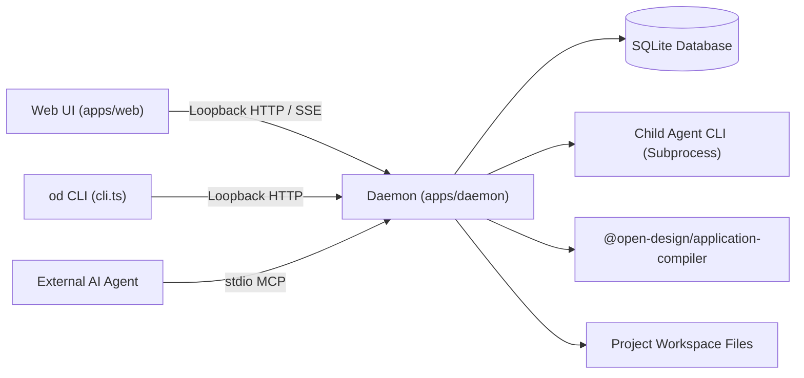

# Subsystem Guide: Daemon Local Backend (`apps/daemon`)

**Parent:** [`docs/architecture.md`](file:///home/sprime01/projects/open-design/docs/architecture.md) · **Source Map:** [`docs/source-map.md`](file:///home/sprime01/projects/open-design/docs/source-map.md)

This document specifies the architecture, operational mechanics, invariants, and extension points of the Open Design Daemon local backend subsystem.

---

## 1. Purpose

The Daemon is the privileged local runtime process and capability authority for Open Design. It mediates access between the web frontend / external CLI agents and local machine resources: the SQLite database, file workspaces, subprocess execution trees, model streaming protocols, and content registries.

---

## 2. Responsibilities

The Daemon exclusively owns:
- **Local Persistence**: Manages the SQLite database via `better-sqlite3` ([`apps/daemon/src/db.ts`](file:///home/sprime01/projects/open-design/apps/daemon/src/db.ts)) for projects, conversations, messages, preview comments, and automation routines.
- **Data Directory Truth**: Resolves `OD_DATA_DIR` into `RUNTIME_DATA_DIR` on startup ([`apps/daemon/src/daemon-paths.ts`](file:///home/sprime01/projects/open-design/apps/daemon/src/daemon-paths.ts)); enforces the Daemon data directory contract.
- **Physical Run Lifecycle**: Manages child process spawning, execution state transitions, output stream parsing, and graceful/forced process tree termination ([`apps/daemon/src/runtimes/runs.ts`](file:///home/sprime01/projects/open-design/apps/daemon/src/runtimes/runs.ts)).
- **HTTP & SSE Service**: Exposes REST endpoints and Server-Sent Events (SSE) for conversation streaming, file uploads, and compiler runs.
- **MCP Server**: Hosts the stdio Model Context Protocol (MCP) server ([`apps/daemon/src/mcp-live-artifacts-server.ts`](file:///home/sprime01/projects/open-design/apps/daemon/src/mcp-live-artifacts-server.ts)) for external agents.
- **Application Compiler Host**: Hosts the async compiler service, project writer, and verification runner ([`apps/daemon/src/compiler/`](file:///home/sprime01/projects/open-design/apps/daemon/src/compiler/)).

---

## 3. Non-Responsibilities

The Daemon deliberately does **NOT** own:
- **UI Rendering & React State**: The daemon serves raw DTOs and SSE events; it contains no React components, DOM logic, or HTML client state.
- **Browser Navigation**: Window management and desktop shell behaviors belong to `apps/desktop`.
- **Sidecar Lifecycle Policy**: Launching and orchestrating sidecar processes belongs to `tools/dev` and `apps/packaged`.
- **Direct Web Imports**: Daemon code is never imported into `apps/web`.

---

## 4. Position in the System

- **Callers**: `apps/web` (via Next.js `/api/*` rewrites), `od` CLI subcommands, external MCP clients (Claude Code, Cursor, Codex).
- **Callees**: `@open-design/application-compiler`, `@open-design/sidecar`, local SQLite DB, external agent CLIs (`claude`, `codex`, `opencode`, etc.).

---

## 5. Core Abstractions

| Symbol / Type | Location | Description |
|---|---|---|
| `RUNTIME_DATA_DIR` | [`daemon-paths.ts`](file:///home/sprime01/projects/open-design/apps/daemon/src/daemon-paths.ts) | Canonical root directory for all daemon-managed persistence. |
| `RunRegistry` | [`runtimes/runs.ts`](file:///home/sprime01/projects/open-design/apps/daemon/src/runtimes/runs.ts) | In-memory registry tracking physical run state machines and PID trees. |
| `internalRunCreation.start` | [`services/internal-run-service.ts`](file:///home/sprime01/projects/open-design/apps/daemon/src/services/internal-run-service.ts) | Mandatory choke point for starting runs to enforce analytics lineage. |
| `SUBCOMMAND_MAP` | [`cli.ts`](file:///home/sprime01/projects/open-design/apps/daemon/src/cli.ts) | Map of user-facing CLI subcommands ensuring UI/CLI parity. |
| `CompilerService` | [`compiler/compiler-service.ts`](file:///home/sprime01/projects/open-design/apps/daemon/src/compiler/compiler-service.ts) | Async compiler run coordinator and plan approver. |

---

## 6. Internal Operation

### Route Architecture
The daemon uses Express. Bootstrapping occurs in `server.ts`, but domain logic is partitioned into dedicated route modules under `apps/daemon/src/routes/`:
- `chat.ts`: Chat turns, SSE streaming, steering.
- `runs.ts`: Physical run inspection, cancellation, logs.
- `compiler.ts`: Compiler validation, planning, async runs, plan approval.
- `projects/`: Project creation, folder import, file tree inspection, uploads.
- `design-systems.ts`: Brand tokens and fixture catalog queries.
- `mcp-routes.ts`: MCP tool inspection and agent installation.

### Run Lifecycle & Process Tree Teardown
When an agent is triggered:
1. `internalRunCreation.start()` mints a run ID and registers analytics context.
2. The agent CLI is spawned with `cwd` set to the project workspace.
3. Stdout is piped to a stream parser (e.g. `claude-stream.ts`) which emits normalized SSE events (`text_delta`, `tool_use`, `file_written`).
4. If cancelled or terminated, `stopProcesses()` recursively collects child PIDs using `collectProcessTreePids()` and issues `SIGTERM` followed by `SIGKILL` to prevent orphaned processes.

---

## 7. State & Persistence

- **SQLite Database**: Stored at `<RUNTIME_DATA_DIR>/sqlite.db`. Manages tables: `projects`, `conversations`, `messages`, `preview_comments`, `routines`, `agent_sessions`.
- **Managed Workspaces**: `<RUNTIME_DATA_DIR>/projects/<id>/`.
- **Ephemeral State**: Active runs, SSE client subscriber sets, process handles, and stream replay buffers exist purely in memory. Interrupted runs are reconciled on reboot to status `failed` with code `DAEMON_RESTARTED`.

---

## 8. Failure Modes

| Symptom | Cause | Diagnostic Command | Recovery |
|---|---|---|---|
| Port conflict on startup (`EADDRINUSE`) | Another process holds daemon port (default 7456). | `pnpm tools-dev check` | Specify alternative port via `--daemon-port <port>`. |
| `PLAN_HASH_MISMATCH` (409) | Approving a compile plan whose underlying files changed. | `od app run get <id>` | Re-run `od app plan` to compute a fresh plan hash. |
| SQLite locked (`SQLITE_BUSY`) | Multiple processes opened DB without WAL mode or long transaction held. | Check running daemon instances: `pnpm tools-dev status` | Terminate orphaned instances via `pnpm tools-dev stop`. |
| Subprocess zombie leak | Agent CLI failed to respond to SIGTERM. | `ps aux \| grep -E 'claude\|codex\|opencode'` | Handled automatically by `stopProcesses()` SIGKILL escalation. |

---

## 9. Extension Points

- **Adding a Domain Route**: Add a new module `apps/daemon/src/routes/<domain>.ts`, register request/response DTOs in `packages/contracts`, wire into `server.ts`, and register the matching CLI subcommand in `cli.ts`.
- **Adding a Migration**: Add an idempotent schema migration in `apps/daemon/src/db.ts`.

---

## 10. Source Trail

- [`apps/daemon/src/server.ts`](file:///home/sprime01/projects/open-design/apps/daemon/src/server.ts) — Composition root.
- [`apps/daemon/src/daemon-paths.ts`](file:///home/sprime01/projects/open-design/apps/daemon/src/daemon-paths.ts) — `RUNTIME_DATA_DIR` resolution.
- [`apps/daemon/src/db.ts`](file:///home/sprime01/projects/open-design/apps/daemon/src/db.ts) — SQLite table schemas and migrations.
- [`apps/daemon/src/runtimes/runs.ts`](file:///home/sprime01/projects/open-design/apps/daemon/src/runtimes/runs.ts) — In-memory run service.
- [`apps/daemon/src/services/internal-run-service.ts`](file:///home/sprime01/projects/open-design/apps/daemon/src/services/internal-run-service.ts) — Mandatory run creation choke point.
- [`apps/daemon/src/compiler/compiler-service.ts`](file:///home/sprime01/projects/open-design/apps/daemon/src/compiler/compiler-service.ts) — Compiler daemon orchestration.
