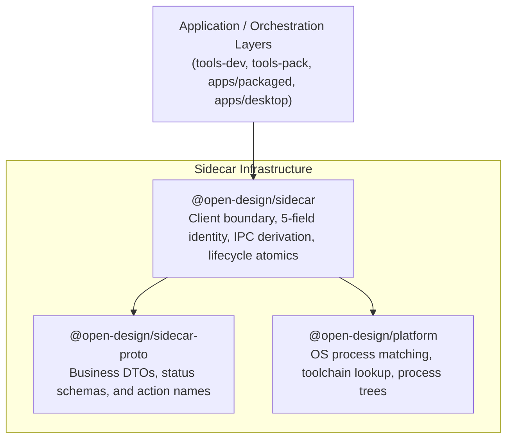

# Subsystem Guide: Sidecar & Process Management Infrastructure

**Parent:** [`docs/architecture.md`](file:///home/sprime01/projects/open-design/docs/architecture.md) · **Source Map:** [`docs/source-map.md`](file:///home/sprime01/projects/open-design/docs/source-map.md) · **Explanation:** [`docs/explanations/sidecar-process-stamps.md`](file:///home/sprime01/projects/open-design/docs/explanations/sidecar-process-stamps.md)

This document specifies the architecture, identity invariants, private IPC derivation, and lifecycle atomics of the Sidecar subsystem.

---

## 1. Purpose

The Sidecar subsystem provides robust, business-agnostic process management for Open Design. It ensures that the daemon and web runtimes can be spawned, discovered, inspected, and cleanly terminated across diverse host environments (source development via `tools-dev`, packaged desktop apps via Electron, or containerized production) without race conditions, port collisions, or leaked zombie processes.

---

## 2. Package Architecture

The sidecar capability is divided into three layered, business-agnostic packages:



1. **`@open-design/sidecar-proto`**: Pure TypeScript interface definitions for sidecar action names, DTO envelopes, and status responses. Free of process or OS APIs.
2. **`@open-design/sidecar`**: Complete sidecar client boundary. Manages process discovery, private transport derivation, resource ownership, and graceful termination. It never hardcodes product-specific app names or business routes.
3. **`@open-design/platform`**: Generic OS-level process primitives (tree traversal, command parsing, binary discovery, signal escalation).

---

## 3. The 5-Field Sidecar Stamp Invariant

Process identity is governed by an immutable 5-tuple passed exclusively via command-line arguments:

```bash
--od-stamp-channel <channel>     # e.g. stable, beta, prerelease, preview, dev
--od-stamp-namespace <namespace> # e.g. default, or test-isolated worker ID
--od-stamp-source <source>       # e.g. tools-dev, packaged
--od-stamp-mode <mode>           # e.g. development, production
--od-stamp-app <app>             # e.g. daemon, web, desktop
```

### Strict Architectural Rules:
- **Argv-Only Identity**: A process's identity is defined strictly by its CLI arguments. Open Design never writes pidfiles or stamp-derived identity state files to disk.
- **IPC is Implementation Detail**: The IPC endpoint path is **never** a stamp field; it is computed deterministically.
- **Port Independence**: Network ports (e.g. `7456`, `17573`) are transient transport details. Runtime data paths, logs, caches, and IPC endpoints must never incorporate port numbers.

---

## 4. Private IPC Derivation

Sidecars communicate control-plane status over private IPC endpoints derived deterministically by `@open-design/sidecar`:

- **POSIX (macOS / Linux)**: A principal-scoped, SHA-256 hashed directory under the OS temporary directory (`/tmp/od-<hash>/<stamp>.sock`). Permissions restrict access to the current OS user only.
- **Windows**: Named pipes formatted as `\\.\pipe\od-<principal-hash>-<stamp>`.

Callers must treat the concrete path as completely opaque. Orchestration tools query the endpoint solely through the `SidecarClient` interface.

---

## 5. Lifecycle Atomics & Discovery

### Process Discovery
When `tools-dev status` or `desktop` searches for running sidecars:
1. `listProcessSnapshots()` scans running processes matching the current OS user.
2. It parses the `--od-stamp-*` arguments to reconstruct the 5-field stamp.
3. It connects to the derived private IPC endpoint to perform a health probe.
4. Active processes report their ready status, version, and HTTP listening URLs.

### Desktop Startup Discovery
The Electron desktop shell (`apps/desktop`) never guesses ports:
1. Desktop launches and reads its configured namespace stamp.
2. It initializes a `SidecarClient` targeting the matching daemon sidecar.
3. Once the daemon reports `ready: true`, desktop retrieves the active web URL and opens the browser window.

---

## 6. Failure Modes

| Symptom | Cause | Diagnostic Command | Resolution |
|---|---|---|---|
| Sidecar client timeout | Child process died during bootstrap or crashed on bad config. | `pnpm tools-dev logs --json` | Inspect stdout/stderr logs under `.tmp/tools-dev/<namespace>/`. |
| `EPERM` on Unix socket | Prior run left socket owned by another user or root. | `ls -la /tmp/od-*/` | Remove stale socket file or switch namespaces via `--namespace`. |
| Port drift between runs | Random port collision on dynamic port allocation. | `pnpm tools-dev status` | Specify explicit ports via `--daemon-port` and `--web-port`. |

---

## 7. Source Trail

- [`packages/sidecar/src/index.ts`](file:///home/sprime01/projects/open-design/packages/sidecar/src/index.ts) — Sidecar client and lifecycle primitives.
- [`packages/sidecar/src/stamp.ts`](file:///home/sprime01/projects/open-design/packages/sidecar/src/) — 5-field stamp parser and validator.
- [`packages/sidecar-proto/src/index.ts`](file:///home/sprime01/projects/open-design/packages/sidecar-proto/src/index.ts) — DTO contracts and status shapes.
- [`packages/platform/src/process.ts`](file:///home/sprime01/projects/open-design/packages/platform/src/) — Generic OS process matching and termination.
- [`apps/packaged/src/sidecars.ts`](file:///home/sprime01/projects/open-design/apps/packaged/src/sidecars.ts) — Packaged Electron sidecar spawner.
