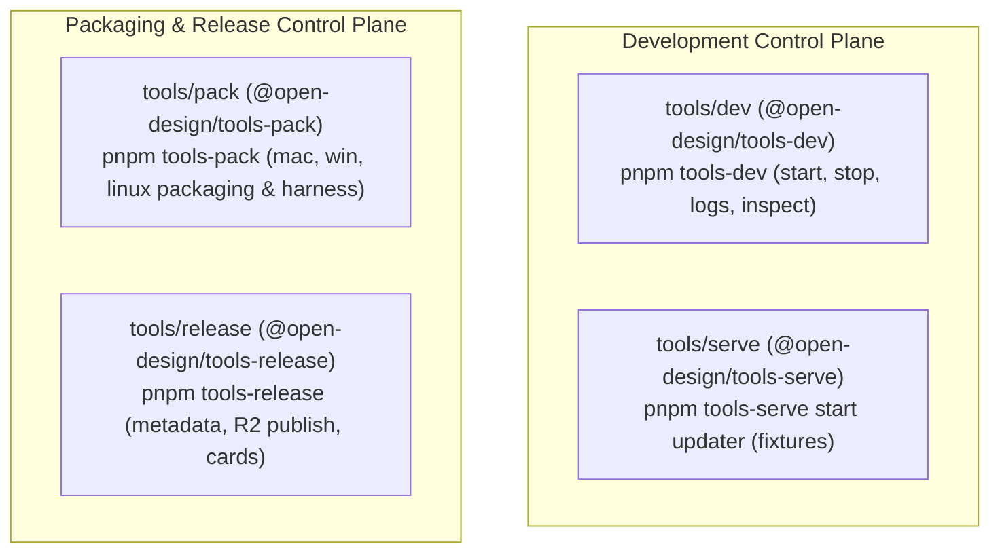

# Subsystem Guide: Development & Packaging Tools (`tools/`)

**Parent:** [`docs/architecture.md`](file:///home/sprime01/projects/open-design/docs/architecture.md) · **Source Map:** [`docs/source-map.md`](file:///home/sprime01/projects/open-design/docs/source-map.md) · **Local Lifecycle Trace:** [`docs/workflows/local-dev-lifecycle.md`](file:///home/sprime01/projects/open-design/docs/workflows/local-dev-lifecycle.md)

This document specifies the architecture and usage of Open Design's developer and packaging control planes: `tools/dev`, `tools/pack`, `tools/serve`, and `tools/release`.

---

## 1. Purpose

Open Design avoids messy, ad-hoc shell scripts and brittle npm scripts by providing unified, typed control planes for local development, packaged Electron builds, fixture services, and release pipelines.

---

## 2. Active Tool Modules



1. **`tools/dev`**: The single authoritative local development lifecycle entry point. Manages daemon -> web -> desktop sidecar launch, log streaming, and desktop inspection.
2. **`tools/pack`**: Builds, installs, tests, and uninstalls packaged Electron deliverables (macOS DMG/ZIP, Windows NSIS, Linux AppImage).
3. **`tools/serve`**: Local fixture service for testing auto-updater metadata and download flows without connecting to production CDN endpoints.
4. **`tools/release`**: Release channel coordinator. Validates release metadata, uploads signed binaries to Cloudflare R2, and drives progressive Feishu notifications.

---

## 3. Local Development Plane (`tools/dev`)

### Core Command Set:
```bash
pnpm tools-dev                     # Start daemon -> web -> desktop
pnpm tools-dev run web             # Foreground daemon + web (for Playwright e2e)
pnpm tools-dev status --json       # Query sidecar process health & URLs
pnpm tools-dev logs --json         # Stream combined sidecar logs
pnpm tools-dev inspect desktop ... # Inspect Electron renderer via sidecar IPC
pnpm tools-dev stop                # Cleanly shut down running sidecars
pnpm tools-dev check               # Check port availability and environment health
```

### Critical Rules:
- **No Root Lifecycle Aliases**: Root `pnpm dev`, `pnpm start`, or `pnpm daemon` are deliberately forbidden. All development execution flows through `pnpm tools-dev`.
- **Authoritative Port Flags**: Ports are governed exclusively via `--daemon-port` and `--web-port`. The tool exports `OD_PORT` and `OD_WEB_PORT`; `NEXT_PORT` is forbidden.
- **Isolated Namespaces**: Passing `--namespace <name>` isolates all runtime logs and sidecar IPC sockets under `.tmp/tools-dev/<namespace>/`.

---

## 4. Packaging & Updater Control Plane (`tools/pack`)

`tools/pack` provides cross-platform packaging commands and an end-to-end acceptance harness for auto-update verification:

### Platform Build Commands:
```bash
# macOS (arm64 & x64 Universal/DMG)
pnpm tools-pack mac build --to all
pnpm tools-pack mac install
pnpm tools-pack mac cleanup

# Windows (NSIS Installer & Portable)
pnpm tools-pack win build --to nsis
pnpm tools-pack win install
pnpm tools-pack win cleanup

# Linux (AppImage & Containerized)
pnpm tools-pack linux build --to appimage
pnpm tools-pack linux install --headless
pnpm tools-pack linux build --containerized
```

### High-Confidence Updater Acceptance Harness:
To test auto-updates locally without uploading to CDN:
1. `tools-serve start updater` serves synthetic release manifests and versioned DMGs/installers on a local fixture port.
2. `tools-pack <platform> install` installs a baseline version.
3. The desktop shell queries the local updater fixture, verifies checksums, downloads the payload, and validates after-quit handoff.

---

## 5. Release Publication & Notifications (`tools/release`)

The release pipeline enforces strict channel gates:
- **`beta`**: Daily development validation channel.
- **`prerelease`**: Internal validation channel for stable delivery. Stable releases require validated prerelease artifacts.
- **`stable`**: Formal delivery channel. Requires signed, notarized macOS (both Apple Silicon and Intel x64) and signed Windows NSIS builds.

**One Writer Rule**: The Feishu release notification is owned by a single progressive card writer ([`tools/release/src/notifications/prerelease-card.ts`](file:///home/sprime01/projects/open-design/tools/release/src/notifications/prerelease-card.ts)) using `PATCH` operations to prevent duplicate or conflicting notifications.

---

## 6. Source Trail

- [`tools/dev/src/`](file:///home/sprime01/projects/open-design/tools/dev/src/) — `tools-dev` lifecycle implementation.
- [`tools/pack/src/`](file:///home/sprime01/projects/open-design/tools/pack/src/) — Packaging control plane and updater harness.
- [`tools/serve/src/`](file:///home/sprime01/projects/open-design/tools/serve/src/) — Fixture service runtime.
- [`tools/release/src/`](file:///home/sprime01/projects/open-design/tools/release/src/) — Release publishing and Feishu progressive card rendering.
