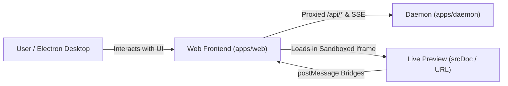

# Subsystem Guide: Web Frontend (`apps/web`)

**Parent:** [`docs/architecture.md`](file:///home/sprime01/projects/open-design/docs/architecture.md) · **Source Map:** [`docs/source-map.md`](file:///home/sprime01/projects/open-design/docs/source-map.md)

This document specifies the architecture, UI components, preview bridges, styling rules, and extension points of the Open Design Web Frontend subsystem.

---

## 1. Purpose

The Web Frontend is the primary interactive user interface for Open Design. Built on Next.js 16 (App Router) and React 18, it provides the visual canvas where human designers collaborate with AI coding agents, inspect live preview deliverables, clarify requirements, and direct project generation.

---

## 2. Responsibilities

The Web Frontend exclusively owns:
- **Application Shell & Navigation**: Project selection, conversation tabs, settings modal, and workspace views ([`apps/web/src/App.tsx`](file:///home/sprime01/projects/open-design/apps/web/src/App.tsx)).
- **Chat & Execution UI**: Rendering message histories, the prompt composer, tool execution groups, and the active execution plan ([`apps/web/src/components/chat/`](file:///home/sprime01/projects/open-design/apps/web/src/components/chat/)).
- **Live Preview Management**: Managing sandboxed iframes, evaluating `srcDoc` vs. URL-load render modes, and injecting interactive bridges ([`apps/web/src/components/file-viewer-render-mode.ts`](file:///home/sprime01/projects/open-design/apps/web/src/components/file-viewer-render-mode.ts)).
- **Interactive Clarification**: Detecting and rendering `<question-form>` artifacts directly inside assistant chat messages ([`apps/web/src/artifacts/question-form.ts`](file:///home/sprime01/projects/open-design/apps/web/src/artifacts/question-form.ts)).
- **Internationalization (i18n)**: Managing localized strings across 19 supported languages ([`apps/web/src/i18n/`](file:///home/sprime01/projects/open-design/apps/web/src/i18n/)).

---

## 3. Non-Responsibilities

The Web Frontend deliberately does **NOT** own:
- **Database Storage**: The web app maintains no local database; all projects, conversations, messages, and files are hydrated via daemon REST APIs.
- **Process Spawning**: The web runtime never invokes `child_process.spawn()` or executes local system commands.
- **Sidecar IPC**: The web app does not participate in private IPC; it is loaded by Electron desktop as a client.
- **Direct Daemon Source Imports**: The web app never imports from `apps/daemon/src/**`.

---

## 4. Position in the System

- **Callers**: User in modern browsers (Chrome, Safari, Firefox, Edge) or the Electron Desktop shell.
- **Callees**: Daemon REST/SSE endpoints via `next.config.ts` rewrites to `OD_PORT`.

---

## 5. Core Abstractions & Components

| Component / Module | Path | Description |
|---|---|---|
| `App.tsx` | [`src/App.tsx`](file:///home/sprime01/projects/open-design/apps/web/src/App.tsx) | Root application component orchestrating active project state, chat, and preview panes. |
| `ChatPane.tsx` | [`src/components/chat/ChatPane.tsx`](file:///home/sprime01/projects/open-design/apps/web/src/components/chat/ChatPane.tsx) | Conversation log, autoscroll observer, and prompt input composer. |
| `ExecutionShell.tsx` | [`src/components/chat/ExecutionShell.tsx`](file:///home/sprime01/projects/open-design/apps/web/src/components/chat/ExecutionShell.tsx) | Collapsible execution record displaying planned steps and tool execution drawers. |
| `PlanPill.tsx` | [`src/components/chat/PlanPill.tsx`](file:///home/sprime01/projects/open-design/apps/web/src/components/chat/PlanPill.tsx) | Pinned capsule above the composer indicating active step `N / M` with an upward hover popover. |
| `QuestionFormView` | [`src/artifacts/question-form.ts`](file:///home/sprime01/projects/open-design/apps/web/src/artifacts/question-form.ts) | Form renderer for inline clarifying questions emitted by the agent. |
| `FileViewer.tsx` | [`src/components/FileViewer.tsx`](file:///home/sprime01/projects/open-design/apps/web/src/components/FileViewer.tsx) | Double-buffered iframe container hosting the live deliverable preview. |

---

## 6. Internal Operation & UI Mechanics

### Render Mode Decision (URL vs. srcDoc)
To preview HTML deliverables, Open Design supports two iframe loading mechanisms:
1. **URL-Load**: Standard HTTP load from daemon `/api/projects/:id/files/:path`. Used for static multi-page assets where native relative URL resolution is needed.
2. **srcDoc Injection**: HTML is fetched and injected into the iframe's `srcdoc` attribute. Mandatory whenever interactive host bridges are needed:
   - **Deck Bridge**: Slide counter, keyboard navigation, and full-screen presenter mode (`data-od-deck-protocol="1"`).
   - **Visual Inspect**: Clicking elements to extract CSS selectors or copy design tokens.
   - **Comment Anchoring**: Dropping visual pins directly onto DOM elements.
   - **Tweak Palette**: Real-time CSS custom property override sliders.

### Double-Buffered Iframe Mounting
To eliminate white flashes when toggling between URL-load and `srcDoc` modes, `FileViewer` keeps **both** iframes mounted simultaneously in the DOM, swapping visibility via CSS. Event listeners use `isOurIframe(ev.source)` to accept messages while validating that active commands originate only from the visible frame.

### Plan Pill & Auto-Scroll Geometry
The `PlanPill` sits above the composer but outside the `.chat-log` scroll container:
- It uses a `containerRef` observed by `ChatPane`'s `ResizeObserver`.
- DOM order ensures that `PlanPill` mounts before `QueuedSendStrip`, so expanding content pushes upward smoothly without obscuring the chat history.

---

## 7. Styling & Component Guidelines

1. **CSS Modules Default**: New component styles must use CSS Modules (`Component.module.css`). Global stylesheets (`apps/web/src/styles/`) are reserved for tokens and app-shell resets.
2. **Component Reuse**: Reuse primitives from `@open-design/components` (`Button`, `Dialog`, `VisuallyHidden`). Do not introduce raw utility classes like `.btn` or `.primary` in new code.
3. **Animation Discipline**:
   - Default ease-out: `cubic-bezier(0.23, 1, 0.32, 1)`. Sluggish `ease-in` is prohibited.
   - Asymmetric durations: Enter around 200ms, exit around 140ms.
   - Accordion expansion uses `grid-template-rows: 0fr -> 1fr` via `.accordion-collapsible`.
   - Never scale from `0`; start from `scale(0.9)` with opacity fade.

---

## 8. Internationalization (i18n)

Localization is strictly typed. `apps/web/src/i18n/types.ts` defines the canonical `Dict` interface. Every new key must be added to all 19 locale files under `apps/web/src/i18n/locales/*.ts` (`en`, `zh-CN`, `ja`, `es-ES`, `fr`, `de`, etc.). Missing keys trigger a typecheck error during `pnpm typecheck`.

---

## 9. Source Trail

- [`apps/web/src/App.tsx`](file:///home/sprime01/projects/open-design/apps/web/src/App.tsx) — Main client shell.
- [`apps/web/src/components/chat/ChatPane.tsx`](file:///home/sprime01/projects/open-design/apps/web/src/components/chat/ChatPane.tsx) — Chat panel and autoscroll manager.
- [`apps/web/src/components/chat/PlanPill.tsx`](file:///home/sprime01/projects/open-design/apps/web/src/components/chat/PlanPill.tsx) — Pinned plan pill.
- [`apps/web/src/components/file-viewer-render-mode.ts`](file:///home/sprime01/projects/open-design/apps/web/src/components/file-viewer-render-mode.ts) — Preview render mode evaluator.
- [`apps/web/src/runtime/srcdoc.ts`](file:///home/sprime01/projects/open-design/apps/web/src/runtime/srcdoc.ts) — Host bridge postMessage injection.
- [`apps/web/src/artifacts/question-form.ts`](file:///home/sprime01/projects/open-design/apps/web/src/artifacts/question-form.ts) — Question form detection and rendering.
