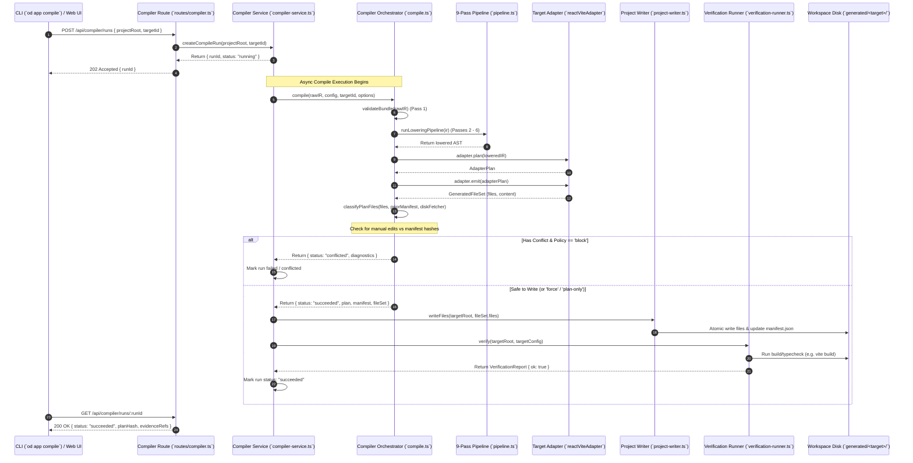

# Workflow: Application Compilation Trace

**Parent:** [`docs/architecture.md`](file:///home/sprime01/projects/open-design/docs/architecture.md) · **Subsystem Guide:** [`docs/subsystems/compiler.md`](file:///home/sprime01/projects/open-design/docs/subsystems/compiler.md) · **Source Map:** [`docs/source-map.md`](file:///home/sprime01/projects/open-design/docs/source-map.md)

This document provides a step-by-step execution trace of an application compilation request from invocation to verified output.

---

## 1. Summary

When a developer or agent compiles an application via `od app compile --project <dir> --target <targetId>` or `POST /api/compiler/runs`, Open Design executes an end-to-end compilation workflow. The daemon validates the intermediate representation (`application.ir.json`), executes a 9-pass lowering pipeline, detects manual file conflicts against previous manifests, invokes the framework target adapter, atomically commits the generated files to disk, and runs build verification before marking the run as succeeded.

---

## 2. Sequence Diagram

---

## 3. Step-by-Step Execution Path

### Step 1: Request Initiation & Route Dispatch
- **Entry Point**: `POST /api/compiler/runs` in [`apps/daemon/src/routes/compiler.ts`](file:///home/sprime01/projects/open-design/apps/daemon/src/routes/compiler.ts).
- **Action**: Validates that `projectRoot` exists and that `targetId` is registered. Mints a unique `runId` and returns a `202 Accepted` response immediately. The compilation proceeds asynchronously on the daemon event loop.

### Step 2: IR Loading & Schema Validation
- **Module**: `prepareAdapterPlan()` in [`packages/application-compiler/src/prepare.ts`](file:///home/sprime01/projects/open-design/packages/application-compiler/src/prepare.ts).
- **Action**: Loads `application.ir.json` and modular documents from `ir/`. Invokes `validateBundle()` from `@open-design/application-ir` to check Zod schemas. If invalid, the run terminates immediately with `failed-validation` and structured diagnostic codes.

### Step 3: 9-Pass Lowering Pipeline
- **Module**: `runLoweringPipeline()` in [`packages/application-compiler/src/pipeline.ts`](file:///home/sprime01/projects/open-design/packages/application-compiler/src/pipeline.ts).
- **Execution**: The validated IR traverses `resolvePass`, `normalizePass`, `domainCheckPass`, `capabilityCheckPass`, `frontendSemanticLoweringPass`, `componentLoweringPass`, `atomicValidationPass`, `platformLoweringPass`, and `targetPlanningPass`.
- **Output**: A normalized, framework-agnostic AST ready for target projection.

### Step 4: Adapter Projection
- **Module**: `adapter.emit()` in the matching target adapter (e.g. `packages/application-targets/src/frontend/react-vite.ts`).
- **Action**: The adapter traverses the lowered AST nodes and renders concrete source files (components, styles, routes, configurations). Returns a `GeneratedFileSet` containing relative paths and file content strings.

### Step 5: Conflict Classification
- **Module**: `classifyPlanFiles()` in [`packages/application-compiler/src/conflict.ts`](file:///home/sprime01/projects/open-design/packages/application-compiler/src/conflict.ts).
- **Action**: Inspects existing files on disk and compares their hashes against `compiler/manifests/<target>.manifest.json`.
- **Branch**: If a file exists on disk, differs from the previous manifest hash, and the conflict policy is `block`, compilation halts with status `conflicted`.

### Step 6: Atomic Disk Write
- **Module**: `ProjectWriter.writeFiles()` in [`apps/daemon/src/compiler/project-writer.ts`](file:///home/sprime01/projects/open-design/apps/daemon/src/compiler/project-writer.ts).
- **Action**: Writes non-conflicting files into `generated/<target>/`. Commits the updated `GeneratedFileManifest` containing cryptographic content hashes for all emitted files.

### Step 7: Build & Typecheck Verification
- **Module**: `VerificationRunner.verify()` in [`apps/daemon/src/compiler/verification-runner.ts`](file:///home/sprime01/projects/open-design/apps/daemon/src/compiler/verification-runner.ts).
- **Action**: Spawns validation commands inside the target directory (e.g. `pnpm install`, `vite build`, `next build`). Captures stdout/stderr into `compiler/evidence/`. If the build fails, the run status transitions to `failed-verification`.

---

## 4. State Changes

| Phase | Filesystem / Memory State Change |
|---|---|
| Request Accepted | Run registered in memory (`CompilerService.runs`) with status `running`. |
| Planning | In-memory `CompilePlan` constructed with `planHash`. |
| Writing | New/updated files written to `generated/<target>/`; updated manifest written to `compiler/manifests/<target>.manifest.json`. |
| Verification | Verification log written to `compiler/evidence/<runId>.verification.json`. |
| Terminal | Run status updated to `succeeded` or error code; metrics aggregated in `CompilerMetricsTracker`. |

---

## 5. Failure Branches & Recovery

- **`failed-validation`**: The IR schema or cross-references are invalid. Run `od app validate --project <dir>` to inspect diagnostics.
- **`conflicted`**: A generated file was modified by hand. Review conflicting paths via `od app conflicts list --run <runId>`. Resolve by either stashing changes, using `--conflict-resolution plan-only` to preserve manual edits, or `--conflict-resolution force` to overwrite.
- **`failed-verification`**: Emitted code failed to compile. Inspect the build log referenced in `evidenceRefs.verificationPath`.

---

## 6. Source Trail

- [`apps/daemon/src/routes/compiler.ts`](file:///home/sprime01/projects/open-design/apps/daemon/src/routes/compiler.ts) — HTTP route handler.
- [`apps/daemon/src/compiler/compiler-service.ts`](file:///home/sprime01/projects/open-design/apps/daemon/src/compiler/compiler-service.ts) — Run service.
- [`packages/application-compiler/src/compile.ts`](file:///home/sprime01/projects/open-design/packages/application-compiler/src/compile.ts) — Master compiler entrypoint.
- [`packages/application-compiler/src/pipeline.ts`](file:///home/sprime01/projects/open-design/packages/application-compiler/src/pipeline.ts) — 9-pass lowering pipeline.
- [`packages/application-compiler/src/conflict.ts`](file:///home/sprime01/projects/open-design/packages/application-compiler/src/conflict.ts) — Conflict classifier.
- [`apps/daemon/src/compiler/verification-runner.ts`](file:///home/sprime01/projects/open-design/apps/daemon/src/compiler/verification-runner.ts) — Verification runner.
