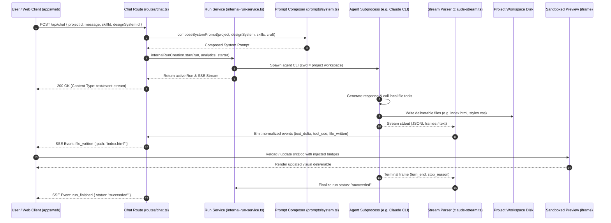

# Workflow: Creative Generation Lifecycle Trace

**Parent:** [`docs/architecture.md`](file:///home/sprime01/projects/open-design/docs/architecture.md) · **Subsystem Guide:** [`docs/subsystems/daemon.md`](file:///home/sprime01/projects/open-design/docs/subsystems/daemon.md) · **Source Map:** [`docs/source-map.md`](file:///home/sprime01/projects/open-design/docs/source-map.md)

This document traces the complete execution lifecycle of an interactive generation request from the user's prompt in the chat panel to the rendered deliverable in the live preview.

---

## 1. Summary

When a user submits a prompt in the Creative Studio, the web client sends an HTTP POST request to the daemon's `/api/chat` route. The daemon resolves the project context, design system, and skills, composes the system prompt, registers a physical run through the internal run service, spawns the local coding agent CLI, normalizes stdout into Server-Sent Events, and updates the live sandboxed preview in real time as the agent writes files to disk.

---

## 2. Sequence Diagram

---

## 3. Detailed Execution Path

### Step 1: Prompt Submission & Route Entry
- **Entry Point**: `POST /api/chat` in [`apps/daemon/src/routes/chat.ts`](file:///home/sprime01/projects/open-design/apps/daemon/src/routes/chat.ts).
- **Action**: Persists the incoming user message to SQLite (`messages` table) and establishes a long-lived `text/event-stream` response with keepalives.

### Step 2: Context Resolution & Prompt Composition
- **Module**: `apps/daemon/src/prompts/system.ts`.
- **Fork Point**: If the run carries an OD Next recipe (`odNextStrategyRecipe`), execution branches immediately to `composeOdNextStrategyRequestPromptV2()`, bypassing legacy prompt composition. Otherwise, it composes:
  1. Base charter (`core-slim.ts` or classic).
  2. Brand tokens and guidelines from `design-systems/<brand>/DESIGN.md`.
  3. Skill instructions from `skills/<skill>/SKILL.md`.
  4. Universal craft rules from `craft/*.md` opted into by the skill.

### Step 3: Physical Run Registration
- **Module**: `internalRunCreation.start()` in [`apps/daemon/src/services/internal-run-service.ts`](file:///home/sprime01/projects/open-design/apps/daemon/src/services/internal-run-service.ts).
- **Action**: Enforces the run start choke point. Attaches analytics context and registers the active run in `RunRegistry` ([`apps/daemon/src/runtimes/runs.ts`](file:///home/sprime01/projects/open-design/apps/daemon/src/runtimes/runs.ts)).

### Step 4: Subprocess Spawning
- **Module**: `launchAgentProcess()` in [`apps/daemon/src/runtimes/launch.ts`](file:///home/sprime01/projects/open-design/apps/daemon/src/runtimes/launch.ts).
- **Action**: Resolves binary executable via `resolveAgentLaunch()`. Spawns the child process with `cwd` bound to the project workspace.
- **Input Delivery**:
  - `text` format: Composed prompt written to `stdin`, closed immediately.
  - `stream-json` format: Prompt written as JSONL user frame; `stdin` remains open for potential steering.

### Step 5: Stdout Stream Normalization
- **Module**: Stream parsers ([`apps/daemon/src/runtimes/claude-stream.ts`](file:///home/sprime01/projects/open-design/apps/daemon/src/runtimes/claude-stream.ts), [`json-event-stream.ts`](file:///home/sprime01/projects/open-design/apps/daemon/src/runtimes/json-event-stream.ts)).
- **Action**: Transforms raw chunks into canonical events (`text_delta`, `tool_use`, `file_written`). Events are forwarded to the SSE response and buffered in memory for replay.

### Step 6: Workspace Update & Live Preview
- **Module**: `apps/web/src/components/FileViewer.tsx`.
- **Action**: When `file_written` events arrive for previewable files (e.g. `index.html`), the web app updates the active preview iframe. If host bridges (deck navigation, inspect, comments) are required, `srcDoc` mode is used to inject postMessage listeners.

### Step 7: Terminal Reconciliation
- **Module**: `apps/daemon/src/runtimes/run-terminal-reconciliation.ts`.
- **Action**: The agent CLI emits its final turn frame. The daemon closes stdin (if open), records terminal analytics, updates SQLite conversation records, and emits `run_finished` over SSE.

---

## 4. State Changes

| State Container | Mutation Description |
|---|---|
| SQLite Database (`db.ts`) | New rows in `messages`, updated timestamp on `conversations`. |
| Project Workspace Filesystem | Files written or modified directly by the agent subprocess. |
| In-Memory `RunRegistry` | Ephemeral run transitions from `created` -> `running` -> `succeeded`. Process tree PIDs tracked and cleaned up. |
| Browser Client State | Chat log appends assistant message; iframe re-renders preview content. |

---

## 5. Failure Branches

- **Process Crash / Non-Zero Exit**: Subprocess exits unexpectedly. The stream parser catches stderr and emits `run_finished { status: "failed", error: ... }`.
- **User Cancellation**: User clicks stop (`POST /api/runs/:id/cancel`). `stopProcesses()` recursively kills the child process tree via `SIGTERM`/`SIGKILL`.
- **Ambiguous Requirements**: The agent emits a `<question-form>` block instead of code. The run completes cleanly with `asked_user_question: true`, and the web UI renders the question form.

---

## 6. Source Trail

- [`apps/daemon/src/routes/chat.ts`](file:///home/sprime01/projects/open-design/apps/daemon/src/routes/chat.ts) — Chat route handler.
- [`apps/daemon/src/services/internal-run-service.ts`](file:///home/sprime01/projects/open-design/apps/daemon/src/services/internal-run-service.ts) — Run creation choke point.
- [`apps/daemon/src/prompts/system.ts`](file:///home/sprime01/projects/open-design/apps/daemon/src/prompts/system.ts) — Prompt composer.
- [`apps/daemon/src/runtimes/launch.ts`](file:///home/sprime01/projects/open-design/apps/daemon/src/runtimes/launch.ts) — Subprocess spawner.
- [`apps/daemon/src/runtimes/claude-stream.ts`](file:///home/sprime01/projects/open-design/apps/daemon/src/runtimes/claude-stream.ts) — Stream parser.
- [`apps/web/src/components/chat/ChatPane.tsx`](file:///home/sprime01/projects/open-design/apps/web/src/components/chat/ChatPane.tsx) — Web chat view.
