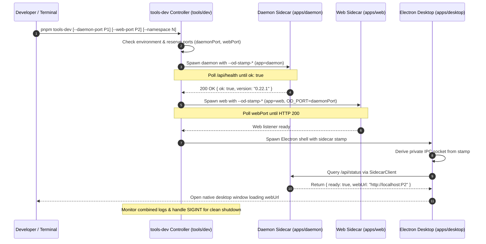

# Workflow: Local Development Lifecycle Trace

**Parent:** [`docs/architecture.md`](file:///home/sprime01/projects/open-design/docs/architecture.md) · **Subsystem Guide:** [`docs/subsystems/tools-dev-pack.md`](file:///home/sprime01/projects/open-design/docs/subsystems/tools-dev-pack.md) · **Source Map:** [`docs/source-map.md`](file:///home/sprime01/projects/open-design/docs/source-map.md)

This document traces the complete execution sequence of the local development control plane when an engineer runs `pnpm tools-dev`.

---

## 1. Summary

Running `pnpm tools-dev` starts the coordinated local development environment: it validates environment health, allocates network ports, launches the Express daemon sidecar, launches the Next.js web sidecar, waits for health readiness probes to pass, and optionally starts the Electron desktop shell. Sidecars communicate via private IPC, and logs are unified under an isolated namespace scratch directory.

---

## 2. Sequence Diagram



---

## 3. Step-by-Step Execution Path

### Step 1: Invocation & Flag Resolution
- **Entry Point**: `tools/dev/src/cli.ts` via `pnpm tools-dev`.
- **Action**: Parses `--daemon-port`, `--web-port`, and `--namespace` (defaults to `default`). If ports are omitted, `tools-dev` searches for open TCP ports starting from defaults (`7456` and `17573`).
- **Namespace Directory**: Sets up `.tmp/tools-dev/<namespace>/` for scratch logs.

### Step 2: Daemon Sidecar Launch
- **Action**: Spawns `node apps/daemon/dist/server.js` (or `tsx apps/daemon/src/server.ts` in dev mode) with five-field stamp arguments:
  ```bash
  --od-stamp-channel dev \
  --od-stamp-namespace default \
  --od-stamp-source tools-dev \
  --od-stamp-mode development \
  --od-stamp-app daemon
  ```
- **Readiness Probe**: `tools-dev` polls `http://127.0.0.1:<daemonPort>/api/health` until the daemon returns `{ ok: true }`.

### Step 3: Web Sidecar Launch
- **Action**: Spawns Next.js using `pnpm --filter @open-design/web run dev` with environment variables:
  - `OD_PORT=<daemonPort>`: Next.js proxies `/api/*`, `/artifacts/*`, and `/frames/*` to this target.
  - `OD_WEB_PORT=<webPort>`: Next.js listener port.
- **Readiness Probe**: `tools-dev` polls `http://localhost:<webPort>` until the frontend responds.

### Step 4: Desktop Shell Launch & Sidecar Handshake
- **Action**: When running full development (not `tools-dev run web`), `tools-dev` spawns Electron (`apps/desktop`).
- **IPC Handshake**: The desktop shell initializes a `SidecarClient`, connects to the private IPC socket, queries daemon status, and navigates its browser window to `http://localhost:<webPort>`.

### Step 5: Clean Shutdown
- **Action**: When the developer presses `Ctrl+C` in the terminal, `tools-dev` intercepts `SIGINT`. It issues coordinated termination requests to desktop, web, and daemon sidecars, ensures all process trees are killed, and removes temporary socket files.

---

## 4. Key Invariants

1. **No Root Lifecycle Scripts**: Developers must not use `pnpm dev` or `pnpm start`. Bypassing `tools-dev` causes mismatched ports and orphaned background processes.
2. **Namespace Isolation**: Running with `--namespace test-worker-1` guarantees that logs, sockets, and runtime scratch cannot collide with another running instance.

---

## 5. Source Trail

- [`tools/dev/src/cli.ts`](file:///home/sprime01/projects/open-design/tools/dev/src/) — `tools-dev` command entrypoint.
- [`tools/dev/src/orchestrator.ts`](file:///home/sprime01/projects/open-design/tools/dev/src/) — Sidecar coordination and polling loop.
- [`apps/desktop/src/main/index.ts`](file:///home/sprime01/projects/open-design/apps/desktop/src/main/) — Desktop sidecar client handshake.
- [`apps/web/next.config.ts`](file:///home/sprime01/projects/open-design/apps/web/) — Next.js `/api/*` proxy rewrite configuration.
