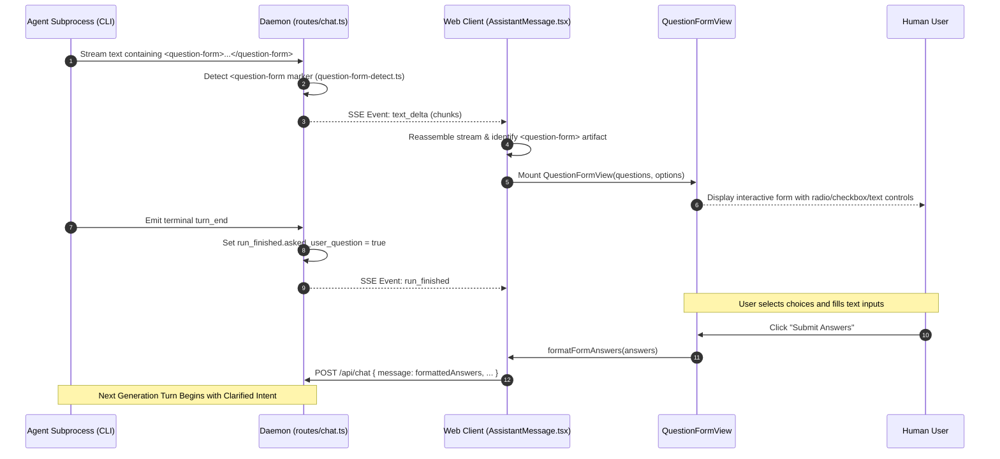

# Workflow: User Clarification (`<question-form>`) Trace

**Parent:** [`docs/architecture.md`](file:///home/sprime01/projects/open-design/docs/architecture.md) · **Subsystem Guide:** [`docs/subsystems/web.md`](file:///home/sprime01/projects/open-design/docs/subsystems/web.md) · **Source Map:** [`docs/source-map.md`](file:///home/sprime01/projects/open-design/docs/source-map.md)

This document traces the end-to-end execution of the human-in-the-loop clarification workflow using the `<question-form>` markdown artifact.

---

## 1. Summary

When a coding agent encounters ambiguous requirements, conflicting constraints, or sensitive domain logic (e.g. auth policies, data retention, branding preferences), it does not guess. Instead, it emits an inline `<question-form>` markdown artifact. The Open Design web interface parses this artifact and renders an interactive, native form directly inside the assistant message. Once the user submits answers, the client formats them as the next conversational turn, allowing the agent to proceed with verified human intent.

---

## 2. Sequence Diagram



---

## 3. Detailed Execution Path

### Step 1: Agent Emits Form Markdown
- **Trigger**: The agent prompt instructs the model to emit a `<question-form>` block whenever user intent requires clarification.
- **Payload Shape**:
  ```markdown
  <question-form>
  # Project Configuration
  Select your preferred target framework and database:
  - [x] React + Vite with SQLite (Recommended)
  - [ ] Next.js 14 App Router
  - [ ] Static HTML preview
  </question-form>
  ```

### Step 2: Daemon Streaming & Analytics Tagging
- **Module**: `apps/daemon/src/question-form-detect.ts`.
- **Action**: As `text_delta` chunks stream through the daemon, the run engine monitors the buffer for `<question-form`. When detected, it flags the run record with `asked_user_question = true`. This feeds the `run_finished.asked_user_question` observability metric without requiring synthetic tool calls.

### Step 3: Frontend Detection & Form Mounting
- **Module**: [`apps/web/src/artifacts/question-form.ts`](file:///home/sprime01/projects/open-design/apps/web/src/artifacts/question-form.ts).
- **Action**: `AssistantMessage.tsx` scans message markdown. When it encounters the `<question-form>` block, it extracts the title, questions, options, and input types into a structured AST and mounts `QuestionFormView`.
- **Design Rule**: The form renders **inline** inside the originating assistant message. It does not open a modal, slide a drawer, or redirect to a separate tab.

### Step 4: User Submission & Continuation
- **Module**: `formatFormAnswers()` in [`apps/web/src/artifacts/question-form.ts`](file:///home/sprime01/projects/open-design/apps/web/src/artifacts/question-form.ts).
- **Action**: When the user clicks "Submit Answers", the client transforms the form state into a readable user response and submits it via `POST /api/chat`.
- **Formatting Example**:
  ```text
  User clarified requirements:
  - Target Framework: React + Vite with SQLite
  - Primary Theme: Dark mode with Stripe aesthetics
  ```
- **Next Turn**: The daemon treats this as an ordinary conversational user turn. The agent receives the explicit decisions in its prompt context and continues execution.

---

## 4. Key Architectural Invariants

1. **No Stdin Tool-Result Injection**: The host does *not* inject answers back into the running agent process via a synthetic `tool_result` frame. The run completes cleanly once the question form is emitted, and answers arrive as the prompt of the *next* turn.
2. **Valid on Any Turn**: Clarifying questions are legal during turn-1 discovery briefs as well as mid-conversation (e.g. after a user provides ambiguous feedback on a generated button).
3. **No Fabricated Defaults**: When authorization, data retention, or destructive operations are ambiguous, the agent must emit `<question-form>` rather than inventing assumptions.

---

## 5. Source Trail

- [`apps/web/src/artifacts/question-form.ts`](file:///home/sprime01/projects/open-design/apps/web/src/artifacts/question-form.ts) — Form AST parser, component renderer, and answer formatter.
- [`apps/daemon/src/question-form-detect.ts`](file:///home/sprime01/projects/open-design/apps/daemon/src/question-form-detect.ts) — Stream marker scanner for analytics.
- [`packages/contracts/src/prompts/discovery.ts`](file:///home/sprime01/projects/open-design/packages/contracts/src/prompts/) — System prompt instructions governing form emission.
